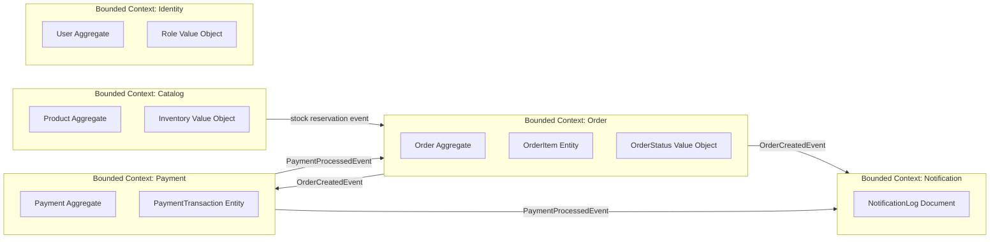
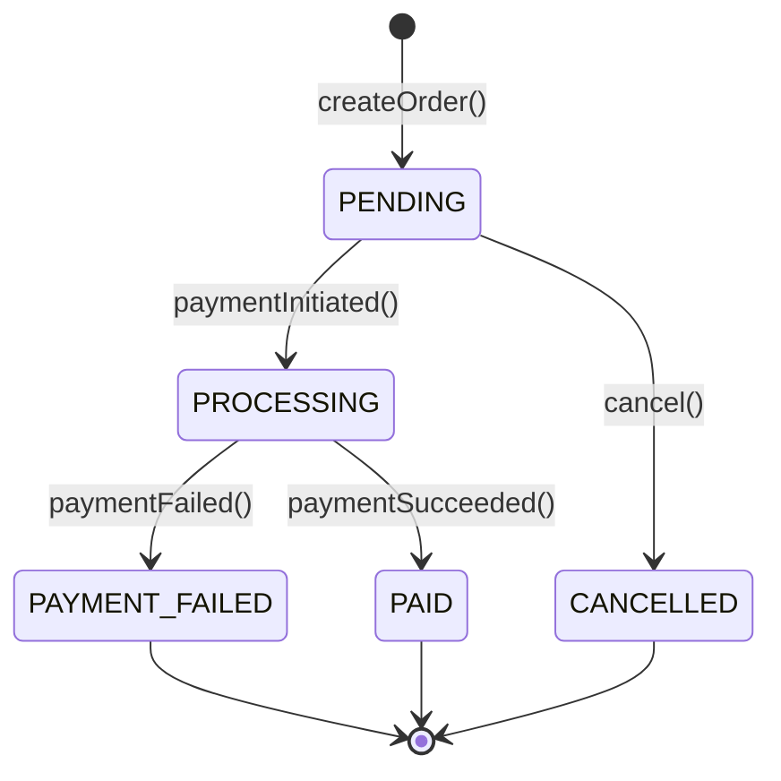
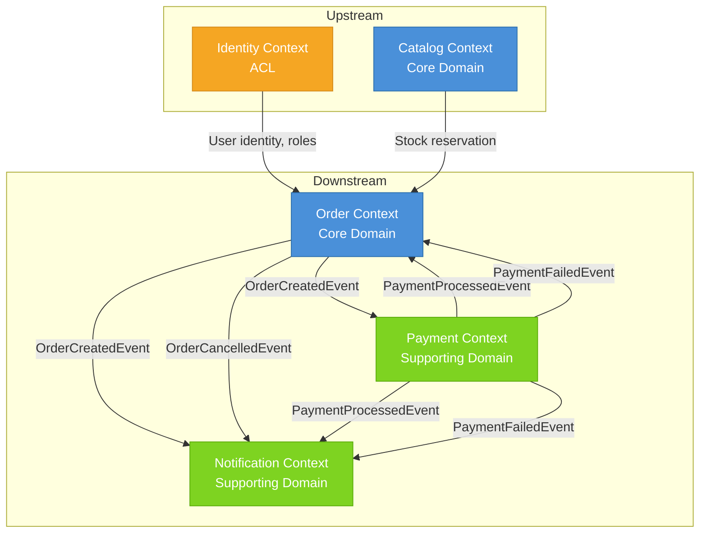
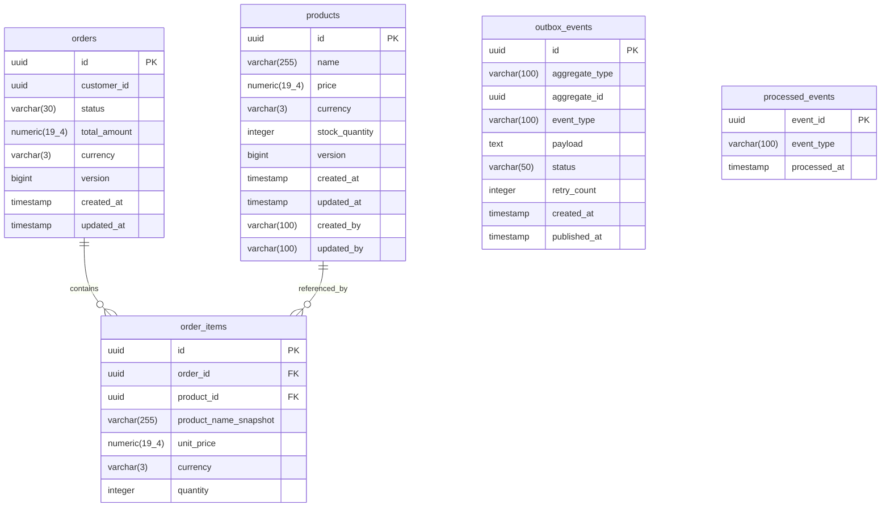
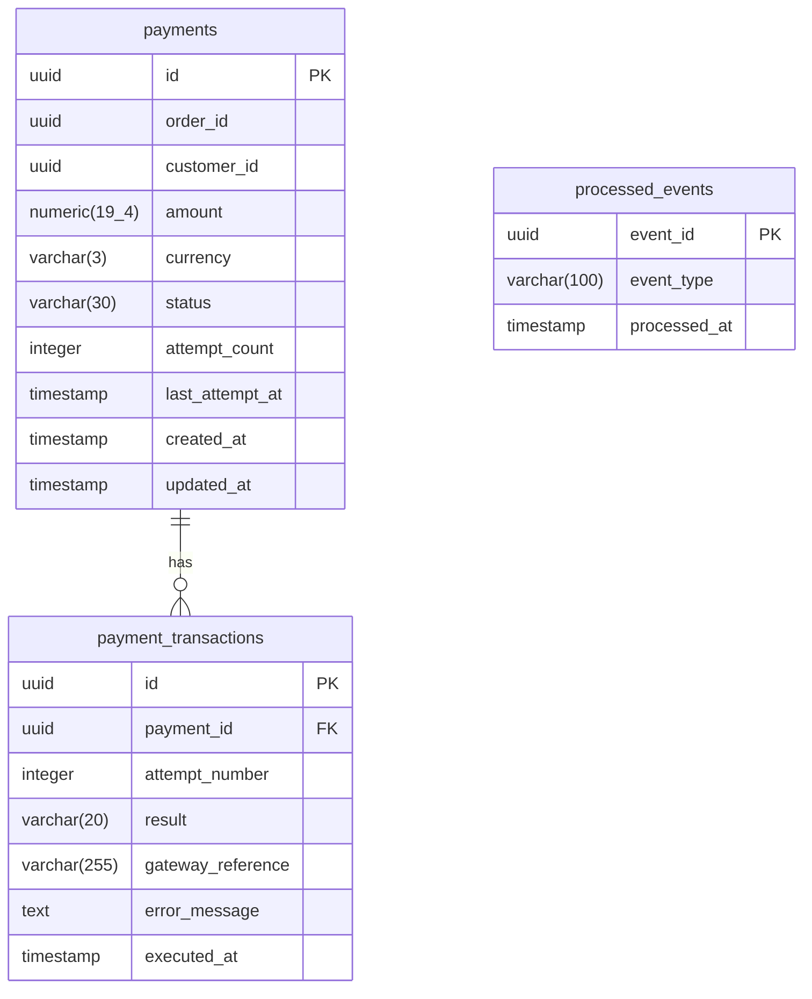
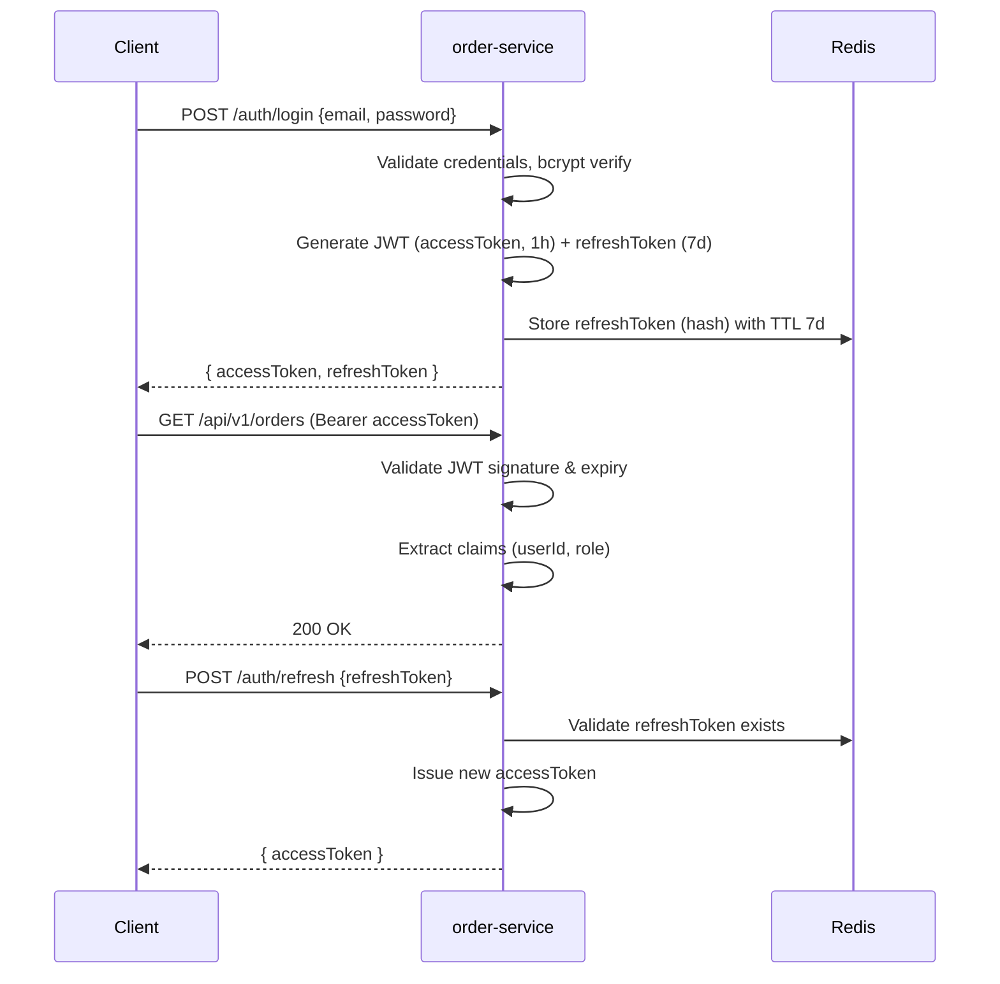
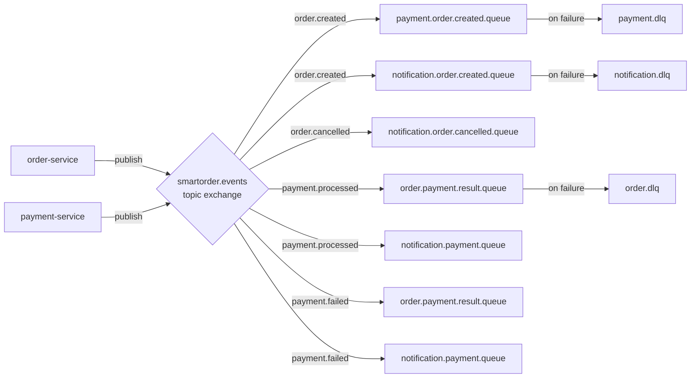
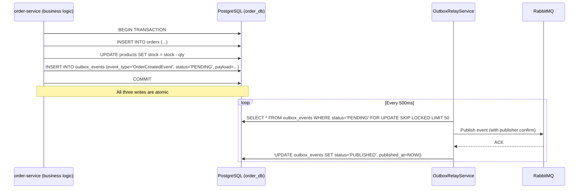
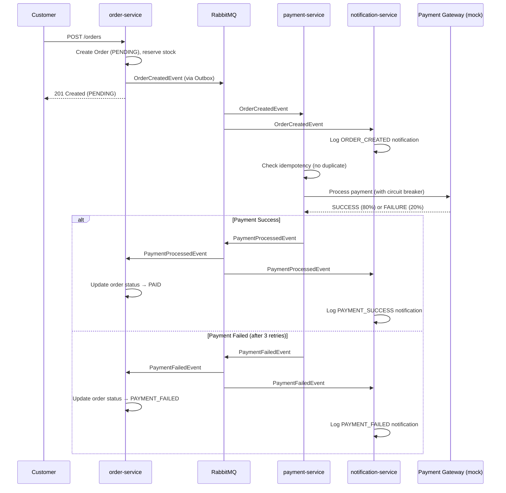

# Unibank-SmartOrder: Production-Grade Enterprise Architecture Blueprint

> **Classification:** Internal Technical Architecture Document  
> **Version:** 1.0.0  
> **Date:** 2026-06-26  
> **Authors:** Principal Software Architect / Tech Lead  
> **Status:** Implementation-Ready

---

## Table of Contents

1. [Executive Summary](#1-executive-summary)
2. [System Architecture](#2-system-architecture)
3. [Domain Driven Design](#3-domain-driven-design)
4. [Project Structure](#4-project-structure)
5. [Database Design](#5-database-design)
6. [API Design](#6-api-design)
7. [Security Architecture](#7-security-architecture)
8. [Event-Driven Architecture](#8-event-driven-architecture)
9. [Infrastructure Architecture](#9-infrastructure-architecture)
10. [CI/CD](#10-cicd)
11. [Testing Strategy](#11-testing-strategy)
12. [Coding Standards](#12-coding-standards)
13. [Development Roadmap](#13-development-roadmap)
14. [Sprint Plan](#14-sprint-plan)
15. [Risk Analysis](#15-risk-analysis)
16. [Production Readiness Checklist](#16-production-readiness-checklist)
17. [Developer Execution Guide](#17-developer-execution-guide)

---

# 1. Executive Summary

## 1.1 Project Overview

**Unibank-SmartOrder** is a production-grade, event-driven Order Management System (OMS) built for Unibank. It manages the full lifecycle of customer orders — from product discovery and order placement through payment processing and customer notification. The system is designed from the ground up for high concurrency, strict data consistency, fault tolerance, and operational observability.

The system is decomposed into three primary bounded contexts — **Catalog**, **Order**, and **Payment/Notification** — each implemented as an independently deployable service following Clean Architecture, DDD, and Hexagonal Architecture principles. Inter-service communication uses an event-driven (Outbox + Message Broker) pattern to guarantee eventual consistency without tight coupling.

## 1.2 Business Goals

| ID | Goal | Priority |
|----|------|----------|
| BG-01 | Enable customers to browse products and place multi-item orders reliably | Critical |
| BG-02 | Guarantee inventory integrity under concurrent load (zero negative stock) | Critical |
| BG-03 | Integrate asynchronous payment processing with automatic retry and failure handling | High |
| BG-04 | Deliver timely, auditable notifications to customers on order lifecycle events | High |
| BG-05 | Protect the system from abuse via rate limiting without degrading honest users | High |
| BG-06 | Provide full end-to-end observability so operations staff can monitor system health without reading logs | Medium |
| BG-07 | Enable zero-friction onboarding: any developer clones the repo and runs one command | Medium |
| BG-08 | Produce a fully documented, testable API surface with interactive developer portal | Medium |

## 1.3 Core Business Domains

| Domain | Description |
|--------|-------------|
| **Product Catalog** | Manages product definitions, pricing, and inventory levels. Subject to high-frequency read traffic; caching is mandatory. |
| **Order Management** | Handles order creation, status lifecycle, and cancellation. Must enforce transactional stock reservation atomically. |
| **Payment Processing** | Processes payments via an external (emulated) payment gateway. Handles retries, circuit breaking, and idempotency. |
| **Notification** | Dispatches structured notifications to customers on order events. Stores an auditable history in a document store. |
| **Identity & Access** | Authenticates users, issues JWT tokens, enforces RBAC (CUSTOMER / ADMIN roles). |

## 1.4 Functional Requirements Summary

| Req ID | Feature | Sprint |
|--------|---------|--------|
| SR-101 | Product catalog: list, detail, update stock | 1 |
| SR-102 | Order creation with atomic stock decrement | 1 |
| SR-103 | Order search with pagination/filter + cancellation with stock rollback | 1 |
| SR-104 | Single-command environment setup | 1 |
| SR-201 | Domain event publication via Outbox Pattern | 2 |
| SR-202 | Asynchronous payment processing (emulated, 80/20 success) | 2 |
| SR-203 | Idempotent event handling (no double payment/notification) | 2 |
| SR-204 | Dead-letter queue management with admin replay | 2 |
| SR-205 | Structured notification log (document store) | 2 |
| SR-301 | Distributed rate limiting (Redis-backed, configurable) | 3 |
| SR-302 | Circuit breaker on payment service with automatic recovery | 3 |
| SR-303 | Exponential-backoff retry for failed payments | 3 |
| SR-304 | Cache stampede protection (warm-up + mutex lock) | 3 |
| SR-401 | Integration tests on real infrastructure (Testcontainers) | 4 |
| SR-402 | Interactive API documentation (OpenAPI / Swagger UI) | 4 |
| SR-403 | Distributed tracing with correlation IDs across all services | 4 |
| SR-404 | Prometheus metrics + Grafana dashboards + alerting rules | 4 |
| SR-405 | README, configuration reference, live demo scenarios | 4 |

## 1.5 Non-Functional Requirements Summary

| Category | Requirement |
|----------|-------------|
| **Consistency** | Inventory must never go negative. Order creation and stock decrement are a single atomic transaction. |
| **Concurrency** | 50 simultaneous order requests for the same last-available unit must produce exactly 1 success. |
| **Performance** | Product list p99 latency < 50 ms (cache-served). Order creation p99 < 500 ms. |
| **Fault Tolerance** | Payment service failure must not block order creation. Orders are queued and retried. Circuit breaker auto-recovers. |
| **Idempotency** | All event consumers are idempotent. Duplicate events are silently discarded after logging. |
| **Rate Limiting** | Per-client sliding-window rate limit, distributed, Redis-backed, configurable without code change. |
| **Observability** | Structured JSON logs, OpenTelemetry traces, Prometheus metrics, Grafana dashboards. |
| **Security** | JWT auth, RBAC, OWASP Top-10 mitigations, secrets via environment variables. |
| **Portability** | Full stack runs via `docker compose up` from a fresh clone. No manual setup steps. |
| **Testability** | Integration tests use real infrastructure via Testcontainers. No mocks for I/O boundaries. |

---

# 2. System Architecture

## 2.1 Architecture Style Decision: Modular Monolith → Microservices

### Decision

The system is implemented as **three independently deployable microservices** with a **shared infrastructure layer**:

1. `order-service` — Catalog + Order bounded contexts (co-deployed initially, separable)
2. `payment-service` — Payment processing + Circuit Breaker
3. `notification-service` — Notification dispatch + document store

### Justification

| Factor | Monolith | Modular Monolith | Microservices (chosen) |
|--------|---------|-----------------|----------------------|
| Independent deployability | ✗ | Partial | ✓ |
| Team autonomy | ✗ | Partial | ✓ |
| Failure isolation | ✗ | Partial | ✓ |
| Complexity | Low | Medium | High |
| Fits domain boundaries | ✗ | ✓ | ✓ |
| Event-driven naturally | ✗ | Partial | ✓ |

Given that:
- The BRD explicitly requires event-driven integration between modules
- Payment and Notification have distinct failure domains
- Each context has radically different scalability profiles (Catalog: read-heavy; Payment: IO-bound; Notification: write-heavy)
- The team must demonstrate independent deployability for the circuit breaker demo (SR-302)

Microservices is the correct choice.

## 2.2 Service Boundaries

```mermaid
graph TB
    Client([Client / Browser])
    AG[API Gateway<br/>nginx / Spring Cloud Gateway]

    subgraph Services
        OS[order-service<br/>:8080]
        PS[payment-service<br/>:8081]
        NS[notification-service<br/>:8082]
    end

    subgraph Infrastructure
        PG[(PostgreSQL<br/>order_db)]
        PGP[(PostgreSQL<br/>payment_db)]
        MG[(MongoDB<br/>notification_db)]
        RD[(Redis<br/>Cache + Rate Limit)]
        RMQ([RabbitMQ<br/>Message Broker)]
    end

    subgraph Observability
        PROM[Prometheus]
        GRAF[Grafana]
        OT[OpenTelemetry Collector]
    end

    Client --> AG
    AG --> OS
    AG --> NS
    OS --> PG
    OS --> RD
    OS --> RMQ
    PS --> PGP
    PS --> RMQ
    NS --> MG
    NS --> RMQ
    OS --> OT
    PS --> OT
    NS --> OT
    OT --> PROM
    PROM --> GRAF
```

## 2.3 Domain Boundaries & Bounded Contexts



## 2.4 Integration Patterns

| Pattern | Used For | Justification |
|---------|---------|---------------|
| **Outbox Pattern** | order-service → broker | Guarantees exactly-once event publication atomically with DB write |
| **Competing Consumers** | payment-service, notification-service | Each service has its own consumer group; independent scaling |
| **Circuit Breaker** | payment-service → external gateway | Prevents cascade failure; auto-recovers |
| **Retry + Exponential Backoff** | payment-service consumer | Handles transient failures gracefully |
| **Dead Letter Queue (DLQ)** | All consumers | Ensures no event is permanently lost |
| **Idempotency Key** | All event handlers | Prevents double-processing of retried events |
| **Cache-Aside** | Catalog reads | Redis cache; miss falls through to DB |
| **Cache Warm-Up** | App startup | Prevents cold-start stampede |
| **Mutex Lock (Cache Stampede)** | Cache expiry | Single DB fetch under Redis distributed lock |
| **Saga (Choreography)** | Order → Payment → Notification | Decentralized, event-driven; no central coordinator |
| **Distributed Rate Limiting** | API Gateway layer | Redis sliding-window counter per client IP/token |

## 2.5 Architectural Decision Records (ADR)

### ADR-001: RabbitMQ as Message Broker

- **Status:** Accepted
- **Context:** Need reliable async communication between services. Options: RabbitMQ, Kafka, AWS SQS.
- **Decision:** RabbitMQ with durable queues, publisher confirms, and DLX (Dead Letter Exchange).
- **Rationale:** RabbitMQ supports complex routing topologies (topic exchanges), has native DLX support for DLQ, and is operationally simpler than Kafka for this scale. Publisher confirms + Outbox Pattern achieve at-least-once delivery.
- **Consequences:** Must implement idempotent consumers. No log compaction (acceptable — we don't need event sourcing replay at this stage).

### ADR-002: Outbox Pattern Over Two-Phase Commit

- **Status:** Accepted
- **Context:** Must ensure event publication and DB write succeed or fail together without distributed transaction.
- **Decision:** Write domain events to an `outbox` table in the same local DB transaction. A separate relay process publishes outbox events to the broker.
- **Rationale:** Avoids XA transactions. Simple, well-understood, PostgreSQL-native. The relay uses polling with `SELECT FOR UPDATE SKIP LOCKED` to be safe for multiple instances.
- **Consequences:** Events are at-least-once. Consumers must be idempotent (ADR-003).

### ADR-003: Consumer Idempotency via Processed-Event Table

- **Status:** Accepted
- **Context:** Outbox relay may publish the same event twice (broker redelivery). Consumers must not double-process.
- **Decision:** Each consumer maintains a `processed_events(event_id, processed_at)` table. Before processing, check existence; after processing, insert. Wrapped in a DB transaction.
- **Rationale:** Simple, reliable, database-native idempotency with O(1) lookup via index.
- **Consequences:** Small storage overhead. Requires periodic cleanup of old records.

### ADR-004: Redis for Cache and Rate Limiting

- **Status:** Accepted
- **Context:** Product catalog needs sub-50ms reads. Rate limiting must work across multiple app instances.
- **Decision:** Redis for cache-aside (product catalog) and sliding-window rate limiting.
- **Rationale:** Redis is the standard solution for both concerns. A single Redis instance serves both, reducing operational overhead. Lettuce (Spring Data Redis) provides reactive and synchronous clients.
- **Consequences:** Redis becomes a critical dependency. Must configure persistence (AOF) and health checks.

### ADR-005: Choreography Saga Over Orchestration

- **Status:** Accepted
- **Context:** Multi-step business process (Order → Payment → Notification) needs coordination.
- **Decision:** Choreography-based Saga where each service reacts to domain events.
- **Rationale:** No central coordinator = no single point of failure. Each service owns its compensating logic. Simpler for the scale of this project.
- **Consequences:** Harder to visualize overall flow (mitigated by distributed tracing). Each service must handle its own compensation.

### ADR-006: MongoDB for Notification Logs

- **Status:** Accepted
- **Context:** Notification logs are append-only, schema-free, write-heavy, and queried by order ID.
- **Decision:** MongoDB for notification storage.
- **Rationale:** Document model fits the flexible notification payload structure. High write throughput. No relational joins needed. Queried only by `orderId` — a single index suffices.
- **Consequences:** Adds a second database technology. Testcontainers handles this transparently in tests.

### ADR-007: Hexagonal Architecture (Ports & Adapters)

- **Status:** Accepted
- **Context:** Need to swap out infrastructure implementations (e.g., real broker vs. in-memory for local dev, real payment gateway vs. emulator).
- **Decision:** Implement Hexagonal Architecture in every service. Domain core has zero external dependencies.
- **Rationale:** Clean separation of domain logic from I/O. Enables testing domain logic without infrastructure. Enables future adapter swaps.
- **Consequences:** More initial boilerplate. Justified by testability and maintainability gains.

---

# 3. Domain Driven Design

## 3.1 Bounded Context: Catalog

### Domain Description
The Catalog context is responsible for the lifecycle of product definitions. It owns product identity, pricing, and inventory levels. It is the system of record for "what can be ordered and at what price."

### Aggregates

**Product Aggregate**
- Aggregate Root: `Product`
- Invariant: `stockQuantity >= 0` always
- Invariant: `price > 0` always

```
Product
├── id: ProductId (Value Object)
├── name: ProductName (Value Object)
├── price: Money (Value Object)
├── stockQuantity: StockQuantity (Value Object)
└── version: long (optimistic lock)
```

### Entities

| Entity | Description |
|--------|-------------|
| `Product` | The aggregate root; represents a purchasable item |

### Value Objects

| Value Object | Type | Validation |
|-------------|------|-----------|
| `ProductId` | UUID | Non-null |
| `ProductName` | String | 1–255 chars, non-blank |
| `Money` | BigDecimal + Currency | > 0, max 2 decimal places |
| `StockQuantity` | int | >= 0 |

### Domain Services

| Service | Responsibility |
|---------|---------------|
| `StockReservationService` | Coordinates stock decrement across one or more product items atomically. Uses pessimistic locking via `SELECT FOR UPDATE`. |

### Domain Events

| Event | Trigger | Payload |
|-------|---------|---------|
| `ProductStockUpdatedEvent` | Admin updates stock | productId, oldQty, newQty, updatedBy, timestamp |
| `StockReservedEvent` | Order creation reserves stock | productId, reservedQty, orderId, timestamp |
| `StockReleasedEvent` | Order cancelled, stock restored | productId, releasedQty, orderId, timestamp |

### Repositories

| Repository | Interface (Port) | Implementation (Adapter) |
|-----------|-----------------|------------------------|
| `ProductRepository` | `findById`, `findAll(Pageable)`, `save`, `findByIdForUpdate` | JPA + PostgreSQL |
| `ProductCacheRepository` | `get(productId)`, `put(product)`, `evict(productId)` | Redis |

---

## 3.2 Bounded Context: Order

### Domain Description
The Order context manages the customer order lifecycle from creation through terminal states (PAID, FAILED, CANCELLED). It enforces business rules around valid state transitions and owns the stock reservation handshake with the Catalog context.

### Aggregates

**Order Aggregate**
- Aggregate Root: `Order`
- Invariants:
  - An Order must have at least one `OrderItem`
  - `Order.totalAmount = sum(item.unitPrice * item.quantity)`
  - State transitions are strictly enforced (see state machine below)

```
Order
├── id: OrderId (Value Object)
├── customerId: CustomerId (Value Object)
├── status: OrderStatus (Value Object)
├── items: List<OrderItem> (Entity)
├── totalAmount: Money (Value Object)
├── createdAt: Instant
└── updatedAt: Instant
```

**OrderItem Entity**
```
OrderItem
├── id: OrderItemId
├── productId: ProductId
├── productName: ProductName (snapshot)
├── unitPrice: Money (snapshot at order time)
└── quantity: Quantity
```

### Order Status State Machine



### Value Objects

| Value Object | Validation |
|-------------|-----------|
| `OrderId` | UUID |
| `CustomerId` | UUID |
| `OrderStatus` | Enum: PENDING, PROCESSING, PAID, PAYMENT_FAILED, CANCELLED |
| `Quantity` | int > 0 |
| `Money` | BigDecimal > 0 |

### Domain Services

| Service | Responsibility |
|---------|---------------|
| `OrderCreationService` | Validates stock availability, reserves stock, creates Order, emits `OrderCreatedEvent`. All in one DB transaction. |
| `OrderCancellationService` | Validates cancellation is allowed (only PENDING), marks cancelled, releases stock, emits `OrderCancelledEvent`. |

### Domain Events

| Event | Trigger | Payload |
|-------|---------|---------|
| `OrderCreatedEvent` | Order created | orderId, customerId, items[], totalAmount, timestamp |
| `OrderCancelledEvent` | Order cancelled | orderId, customerId, items[], timestamp |
| `OrderStatusUpdatedEvent` | Status changes | orderId, oldStatus, newStatus, timestamp |

### Repositories

| Repository | Port Methods |
|-----------|-------------|
| `OrderRepository` | `save`, `findById`, `findByCustomerId(Pageable)`, `findByCustomerIdAndStatus` |
| `OutboxRepository` | `save(OutboxEvent)`, `findUnpublished()`, `markPublished(id)` |

---

## 3.3 Bounded Context: Payment

### Domain Description
The Payment context consumes `OrderCreatedEvent` and orchestrates payment processing via an external gateway (emulated). It owns payment attempt records and enforces idempotency so the same order is never charged twice.

### Aggregates

**Payment Aggregate**
- Aggregate Root: `Payment`

```
Payment
├── id: PaymentId (UUID)
├── orderId: OrderId
├── customerId: CustomerId
├── amount: Money
├── status: PaymentStatus (PENDING, PROCESSING, SUCCESS, FAILED)
├── attemptCount: int
├── lastAttemptAt: Instant
└── transactions: List<PaymentTransaction>
```

**PaymentTransaction Entity**
```
PaymentTransaction
├── id: UUID
├── attemptNumber: int
├── result: SUCCEEDED | FAILED
├── gatewayReference: String
├── errorMessage: String
└── executedAt: Instant
```

### Domain Services

| Service | Responsibility |
|---------|---------------|
| `PaymentProcessingService` | Calls external gateway, records transaction, emits result event |
| `PaymentRetryService` | Manages exponential backoff retry scheduling |
| `CircuitBreakerService` | Tracks gateway health; opens circuit after threshold failures |

### Domain Events

| Event | Trigger | Payload |
|-------|---------|---------|
| `PaymentProcessedEvent` | Payment succeeds | orderId, paymentId, amount, gatewayRef, timestamp |
| `PaymentFailedEvent` | Payment fails (exhausted) | orderId, paymentId, reason, attemptCount, timestamp |

### Repositories

| Repository | Port Methods |
|-----------|-------------|
| `PaymentRepository` | `save`, `findByOrderId`, `findById` |
| `ProcessedEventRepository` | `existsByEventId`, `save` (idempotency guard) |

---

## 3.4 Bounded Context: Notification

### Domain Description
The Notification context listens to business events from Order and Payment contexts and records structured notification logs in MongoDB. It is designed for high write throughput and flexible schema evolution.

### Aggregates

**NotificationLog Document**
```
NotificationLog
├── id: ObjectId
├── orderId: String (indexed)
├── customerId: String
├── type: NotificationType
├── status: NotificationStatus
├── payload: Map<String, Object>
├── sentAt: Instant
└── correlationId: String
```

### Value Objects

| Value Object | Values |
|-------------|--------|
| `NotificationType` | ORDER_CREATED, PAYMENT_SUCCESS, PAYMENT_FAILED, ORDER_CANCELLED |
| `NotificationStatus` | SENT, FAILED |

### Domain Events Consumed

| Event Source | Event | Action |
|-------------|-------|--------|
| Order context | `OrderCreatedEvent` | Log ORDER_CREATED notification |
| Payment context | `PaymentProcessedEvent` | Log PAYMENT_SUCCESS notification |
| Payment context | `PaymentFailedEvent` | Log PAYMENT_FAILED notification |
| Order context | `OrderCancelledEvent` | Log ORDER_CANCELLED notification |

### Repositories

| Repository | Port Methods |
|-----------|-------------|
| `NotificationLogRepository` | `save`, `findByOrderId` |
| `ProcessedEventRepository` | `existsByEventId`, `save` |

---

## 3.5 Bounded Context: Identity & Access

### Domain Description
Manages user identity, authentication, and authorization. Issues JWT access tokens and refresh tokens. Enforces RBAC with CUSTOMER and ADMIN roles.

### Aggregates

**User Aggregate**
```
User
├── id: UserId (UUID)
├── email: Email (Value Object)
├── passwordHash: PasswordHash (Value Object)
├── role: Role (CUSTOMER | ADMIN)
├── active: boolean
└── createdAt: Instant
```

### Domain Events

| Event | Trigger |
|-------|---------|
| `UserRegisteredEvent` | New user registers |
| `UserPasswordChangedEvent` | Password reset |

---

## 3.6 Context Map



---

# 4. Project Structure

## 4.1 Full Repository Layout

```
unibank-smartorder/
├── services/
│   ├── order-service/
│   │   ├── build.gradle
│   │   ├── src/
│   │   │   ├── main/
│   │   │   │   ├── java/az/unibank/smartorder/order/
│   │   │   │   │   ├── domain/
│   │   │   │   │   │   ├── model/
│   │   │   │   │   │   │   ├── aggregate/
│   │   │   │   │   │   │   │   ├── Order.java
│   │   │   │   │   │   │   │   └── Product.java
│   │   │   │   │   │   │   ├── entity/
│   │   │   │   │   │   │   │   └── OrderItem.java
│   │   │   │   │   │   │   ├── valueobject/
│   │   │   │   │   │   │   │   ├── Money.java
│   │   │   │   │   │   │   │   ├── OrderId.java
│   │   │   │   │   │   │   │   ├── OrderStatus.java
│   │   │   │   │   │   │   │   ├── ProductId.java
│   │   │   │   │   │   │   │   ├── StockQuantity.java
│   │   │   │   │   │   │   │   └── CustomerId.java
│   │   │   │   │   │   │   └── event/
│   │   │   │   │   │   │       ├── OrderCreatedEvent.java
│   │   │   │   │   │   │       ├── OrderCancelledEvent.java
│   │   │   │   │   │   │       └── ProductStockUpdatedEvent.java
│   │   │   │   │   │   ├── port/
│   │   │   │   │   │   │   ├── inbound/
│   │   │   │   │   │   │   │   ├── CreateOrderUseCase.java
│   │   │   │   │   │   │   │   ├── CancelOrderUseCase.java
│   │   │   │   │   │   │   │   ├── GetOrderUseCase.java
│   │   │   │   │   │   │   │   ├── ListOrdersUseCase.java
│   │   │   │   │   │   │   │   ├── GetProductUseCase.java
│   │   │   │   │   │   │   │   ├── ListProductsUseCase.java
│   │   │   │   │   │   │   │   └── UpdateStockUseCase.java
│   │   │   │   │   │   │   └── outbound/
│   │   │   │   │   │   │       ├── OrderRepository.java
│   │   │   │   │   │   │       ├── ProductRepository.java
│   │   │   │   │   │   │       ├── ProductCacheRepository.java
│   │   │   │   │   │   │       └── EventPublisher.java
│   │   │   │   │   │   └── service/
│   │   │   │   │   │       ├── OrderCreationService.java
│   │   │   │   │   │       ├── OrderCancellationService.java
│   │   │   │   │   │       └── StockReservationService.java
│   │   │   │   │   ├── application/
│   │   │   │   │   │   ├── command/
│   │   │   │   │   │   │   ├── CreateOrderCommand.java
│   │   │   │   │   │   │   ├── CancelOrderCommand.java
│   │   │   │   │   │   │   └── UpdateStockCommand.java
│   │   │   │   │   │   ├── query/
│   │   │   │   │   │   │   ├── GetOrderQuery.java
│   │   │   │   │   │   │   └── ListOrdersQuery.java
│   │   │   │   │   │   └── handler/
│   │   │   │   │   │       ├── CreateOrderCommandHandler.java
│   │   │   │   │   │       ├── CancelOrderCommandHandler.java
│   │   │   │   │   │       ├── GetOrderQueryHandler.java
│   │   │   │   │   │       └── ListOrdersQueryHandler.java
│   │   │   │   │   ├── infrastructure/
│   │   │   │   │   │   ├── persistence/
│   │   │   │   │   │   │   ├── jpa/
│   │   │   │   │   │   │   │   ├── entity/
│   │   │   │   │   │   │   │   │   ├── OrderJpaEntity.java
│   │   │   │   │   │   │   │   │   ├── OrderItemJpaEntity.java
│   │   │   │   │   │   │   │   │   ├── ProductJpaEntity.java
│   │   │   │   │   │   │   │   │   └── OutboxEventJpaEntity.java
│   │   │   │   │   │   │   │   ├── repository/
│   │   │   │   │   │   │   │   │   ├── OrderJpaRepository.java
│   │   │   │   │   │   │   │   │   ├── ProductJpaRepository.java
│   │   │   │   │   │   │   │   │   └── OutboxJpaRepository.java
│   │   │   │   │   │   │   │   └── mapper/
│   │   │   │   │   │   │   │       ├── OrderPersistenceMapper.java
│   │   │   │   │   │   │   │       └── ProductPersistenceMapper.java
│   │   │   │   │   │   │   └── adapter/
│   │   │   │   │   │   │       ├── OrderPersistenceAdapter.java
│   │   │   │   │   │   │       └── ProductPersistenceAdapter.java
│   │   │   │   │   │   ├── cache/
│   │   │   │   │   │   │   ├── RedisProductCacheAdapter.java
│   │   │   │   │   │   │   └── CacheWarmupService.java
│   │   │   │   │   │   ├── messaging/
│   │   │   │   │   │   │   ├── outbox/
│   │   │   │   │   │   │   │   ├── OutboxEvent.java
│   │   │   │   │   │   │   │   └── OutboxRelayService.java
│   │   │   │   │   │   │   └── adapter/
│   │   │   │   │   │   │       └── RabbitMQEventPublisherAdapter.java
│   │   │   │   │   │   └── ratelimit/
│   │   │   │   │   │       └── RedisRateLimiterService.java
│   │   │   │   │   └── adapter/
│   │   │   │   │       └── inbound/
│   │   │   │   │           └── web/
│   │   │   │   │               ├── controller/
│   │   │   │   │               │   ├── OrderController.java
│   │   │   │   │               │   └── ProductController.java
│   │   │   │   │               ├── dto/
│   │   │   │   │               │   ├── request/
│   │   │   │   │               │   │   ├── CreateOrderRequest.java
│   │   │   │   │               │   │   ├── UpdateStockRequest.java
│   │   │   │   │               │   │   └── OrderItemRequest.java
│   │   │   │   │               │   └── response/
│   │   │   │   │               │       ├── OrderResponse.java
│   │   │   │   │               │       ├── ProductResponse.java
│   │   │   │   │               │       └── PagedResponse.java
│   │   │   │   │               ├── mapper/
│   │   │   │   │               │   ├── OrderWebMapper.java
│   │   │   │   │               │   └── ProductWebMapper.java
│   │   │   │   │               └── filter/
│   │   │   │   │                   ├── RateLimitFilter.java
│   │   │   │   │                   └── CorrelationIdFilter.java
│   │   │   │   └── resources/
│   │   │   │       ├── application.yml
│   │   │   │       ├── application-local.yml
│   │   │   │       ├── application-docker.yml
│   │   │   │       └── db/migration/
│   │   │   │           ├── V1__create_products_table.sql
│   │   │   │           ├── V2__create_orders_tables.sql
│   │   │   │           ├── V3__create_outbox_table.sql
│   │   │   │           ├── V4__seed_initial_products.sql
│   │   │   │           └── V5__create_processed_events_table.sql
│   │   │   └── test/
│   │   │       └── java/az/unibank/smartorder/order/
│   │   │           ├── domain/
│   │   │           │   ├── OrderCreationServiceTest.java
│   │   │           │   ├── StockReservationTest.java
│   │   │           │   └── OrderStatusTransitionTest.java
│   │   │           ├── integration/
│   │   │           │   ├── OrderCreationIntegrationTest.java
│   │   │           │   ├── StockConcurrencyTest.java
│   │   │           │   ├── OutboxRelayIntegrationTest.java
│   │   │           │   ├── RateLimitIntegrationTest.java
│   │   │           │   └── ProductCacheIntegrationTest.java
│   │   │           └── api/
│   │   │               ├── OrderApiTest.java
│   │   │               └── ProductApiTest.java
│   │
│   ├── payment-service/
│   │   ├── build.gradle
│   │   └── src/
│   │       ├── main/
│   │       │   ├── java/az/unibank/smartorder/payment/
│   │       │   │   ├── domain/
│   │       │   │   │   ├── model/
│   │       │   │   │   │   ├── aggregate/Payment.java
│   │       │   │   │   │   ├── entity/PaymentTransaction.java
│   │       │   │   │   │   └── valueobject/
│   │       │   │   │   │       ├── PaymentStatus.java
│   │       │   │   │   │       └── PaymentId.java
│   │       │   │   │   ├── event/
│   │       │   │   │   │   ├── PaymentProcessedEvent.java
│   │       │   │   │   │   └── PaymentFailedEvent.java
│   │       │   │   │   ├── port/
│   │       │   │   │   │   ├── inbound/ProcessPaymentUseCase.java
│   │       │   │   │   │   └── outbound/
│   │       │   │   │   │       ├── PaymentRepository.java
│   │       │   │   │   │       ├── PaymentGatewayPort.java
│   │       │   │   │   │       └── EventPublisher.java
│   │       │   │   │   └── service/PaymentProcessingService.java
│   │       │   │   ├── infrastructure/
│   │       │   │   │   ├── persistence/
│   │       │   │   │   │   ├── jpa/entity/PaymentJpaEntity.java
│   │       │   │   │   │   ├── jpa/repository/PaymentJpaRepository.java
│   │       │   │   │   │   └── adapter/PaymentPersistenceAdapter.java
│   │       │   │   │   ├── gateway/
│   │       │   │   │   │   └── MockPaymentGatewayAdapter.java
│   │       │   │   │   └── messaging/
│   │       │   │   │       ├── consumer/OrderEventConsumer.java
│   │       │   │   │       └── adapter/RabbitMQEventPublisherAdapter.java
│   │       │   │   └── config/
│   │       │   │       ├── RabbitMQConfig.java
│   │       │   │       ├── CircuitBreakerConfig.java
│   │       │   │       └── ResilienceConfig.java
│   │       │   └── resources/
│   │       │       ├── application.yml
│   │       │       └── db/migration/
│   │       │           ├── V1__create_payments_table.sql
│   │       │           └── V2__create_processed_events_table.sql
│   │       └── test/
│   │           └── java/az/unibank/smartorder/payment/
│   │               ├── integration/
│   │               │   ├── PaymentProcessingIntegrationTest.java
│   │               │   ├── IdempotencyIntegrationTest.java
│   │               │   └── CircuitBreakerIntegrationTest.java
│   │               └── domain/PaymentServiceTest.java
│   │
│   └── notification-service/
│       ├── build.gradle
│       └── src/
│           ├── main/
│           │   ├── java/az/unibank/smartorder/notification/
│           │   │   ├── domain/
│           │   │   │   ├── model/NotificationLog.java
│           │   │   │   ├── valueobject/
│           │   │   │   │   ├── NotificationType.java
│           │   │   │   │   └── NotificationStatus.java
│           │   │   │   ├── port/
│           │   │   │   │   ├── inbound/
│           │   │   │   │   │   ├── SendNotificationUseCase.java
│           │   │   │   │   │   └── GetNotificationHistoryUseCase.java
│           │   │   │   │   └── outbound/NotificationLogRepository.java
│           │   │   │   └── service/NotificationService.java
│           │   │   ├── infrastructure/
│           │   │   │   ├── persistence/
│           │   │   │   │   ├── document/NotificationLogDocument.java
│           │   │   │   │   ├── repository/NotificationMongoRepository.java
│           │   │   │   │   └── adapter/NotificationPersistenceAdapter.java
│           │   │   │   └── messaging/
│           │   │   │       └── consumer/
│           │   │   │           ├── OrderEventConsumer.java
│           │   │   │           └── PaymentEventConsumer.java
│           │   │   └── adapter/inbound/web/
│           │   │       └── controller/NotificationController.java
│           │   └── resources/
│           │       └── application.yml
│           └── test/
│               └── java/az/unibank/smartorder/notification/
│                   └── integration/NotificationIntegrationTest.java
│
├── shared/
│   ├── common-events/
│   │   ├── build.gradle
│   │   └── src/main/java/az/unibank/smartorder/events/
│   │       ├── DomainEvent.java
│   │       ├── order/
│   │       │   ├── OrderCreatedEvent.java
│   │       │   └── OrderCancelledEvent.java
│   │       └── payment/
│   │           ├── PaymentProcessedEvent.java
│   │           └── PaymentFailedEvent.java
│   ├── common-security/
│   │   ├── build.gradle
│   │   └── src/main/java/az/unibank/smartorder/security/
│   │       ├── JwtTokenProvider.java
│   │       ├── SecurityConfig.java
│   │       └── UserPrincipal.java
│   └── common-web/
│       ├── build.gradle
│       └── src/main/java/az/unibank/smartorder/web/
│           ├── exception/
│           │   ├── GlobalExceptionHandler.java
│           │   ├── BusinessException.java
│           │   └── ErrorResponse.java
│           └── filter/
│               └── CorrelationIdFilter.java
│
├── infrastructure/
│   ├── docker/
│   │   ├── order-service.Dockerfile
│   │   ├── payment-service.Dockerfile
│   │   └── notification-service.Dockerfile
│   ├── monitoring/
│   │   ├── prometheus/
│   │   │   └── prometheus.yml
│   │   └── grafana/
│   │       ├── provisioning/
│   │       │   ├── datasources/datasource.yml
│   │       │   └── dashboards/dashboard.yml
│   │       └── dashboards/
│   │           └── smartorder-overview.json
│   └── rabbitmq/
│       └── definitions.json
│
├── deployment/
│   ├── docker-compose.yml
│   ├── docker-compose.override.yml
│   └── .env.example
│
├── docs/
│   ├── architecture/
│   │   ├── adr/
│   │   │   ├── ADR-001-rabbitmq.md
│   │   │   └── ADR-002-outbox.md
│   │   └── diagrams/
│   ├── api/
│   │   └── openapi/
│   └── runbook/
│       └── RUNBOOK.md
│
├── .github/
│   ├── workflows/
│   │   ├── ci.yml
│   │   ├── release.yml
│   │   └── security-scan.yml
│   ├── PULL_REQUEST_TEMPLATE.md
│   └── CODEOWNERS
│
├── build.gradle (root)
├── settings.gradle
├── gradle.properties
├── .gitignore
└── README.md
```

## 4.2 Module Responsibilities

| Module | Purpose | Dependencies |
|--------|---------|-------------|
| `order-service` | Core business logic for catalog and orders. REST API entry point for customers and admins. | PostgreSQL, Redis, RabbitMQ, common-events, common-security, common-web |
| `payment-service` | Async payment processing consumer. Calls mock gateway. Publishes payment result events. | PostgreSQL, RabbitMQ, common-events |
| `notification-service` | Async notification consumer. Writes structured logs to MongoDB. Exposes notification history API. | MongoDB, RabbitMQ, common-events |
| `common-events` | Shared event contracts (DTOs). Used as message payload schema. | None (pure data classes) |
| `common-security` | JWT issuance and validation. Spring Security configuration base. | Spring Security, JJWT |
| `common-web` | Global exception handler, error response schema, correlation ID filter. | Spring Web |
| `infrastructure/monitoring` | Prometheus scrape config, Grafana dashboard JSON, alert rules. | None |
| `deployment` | Docker Compose orchestration, environment configuration. | All services |

---

# 5. Database Design

## 5.1 Order Service Database (PostgreSQL: `order_db`)

### Entity Relationship Diagram



### Table Definitions

#### `products`

| Column | Type | Constraints | Notes |
|--------|------|-------------|-------|
| `id` | UUID | PK, DEFAULT gen_random_uuid() | |
| `name` | VARCHAR(255) | NOT NULL | |
| `price` | NUMERIC(19,4) | NOT NULL, CHECK > 0 | |
| `currency` | CHAR(3) | NOT NULL, DEFAULT 'AZN' | ISO 4217 |
| `stock_quantity` | INTEGER | NOT NULL, CHECK >= 0 | |
| `version` | BIGINT | NOT NULL, DEFAULT 0 | Optimistic lock |
| `created_at` | TIMESTAMPTZ | NOT NULL, DEFAULT NOW() | |
| `updated_at` | TIMESTAMPTZ | NOT NULL, DEFAULT NOW() | |
| `created_by` | VARCHAR(100) | | Audit |
| `updated_by` | VARCHAR(100) | | Audit |

**Indexes:**
- `PRIMARY KEY (id)`
- `idx_products_name` on `name` (for search)

#### `orders`

| Column | Type | Constraints | Notes |
|--------|------|-------------|-------|
| `id` | UUID | PK | |
| `customer_id` | UUID | NOT NULL | FK to identity service (logical) |
| `status` | VARCHAR(30) | NOT NULL | Enum: PENDING/PROCESSING/PAID/PAYMENT_FAILED/CANCELLED |
| `total_amount` | NUMERIC(19,4) | NOT NULL | |
| `currency` | CHAR(3) | NOT NULL | |
| `version` | BIGINT | NOT NULL, DEFAULT 0 | |
| `created_at` | TIMESTAMPTZ | NOT NULL | |
| `updated_at` | TIMESTAMPTZ | NOT NULL | |

**Indexes:**
- `PRIMARY KEY (id)`
- `idx_orders_customer_id` on `customer_id`
- `idx_orders_customer_status` on `(customer_id, status)` — supports filtered list queries
- `idx_orders_created_at` on `created_at DESC` — supports sorted list queries

**Partitioning Strategy:** Range partition by `created_at` (monthly) when record count > 10M. Use `pg_partman` for automated partition creation.

#### `order_items`

| Column | Type | Constraints |
|--------|------|-------------|
| `id` | UUID | PK |
| `order_id` | UUID | NOT NULL, FK → orders(id) ON DELETE CASCADE |
| `product_id` | UUID | NOT NULL |
| `product_name_snapshot` | VARCHAR(255) | NOT NULL |
| `unit_price` | NUMERIC(19,4) | NOT NULL |
| `currency` | CHAR(3) | NOT NULL |
| `quantity` | INTEGER | NOT NULL, CHECK > 0 |

**Indexes:**
- `PRIMARY KEY (id)`
- `idx_order_items_order_id` on `order_id`

#### `outbox_events`

| Column | Type | Constraints | Notes |
|--------|------|-------------|-------|
| `id` | UUID | PK | |
| `aggregate_type` | VARCHAR(100) | NOT NULL | e.g., "Order" |
| `aggregate_id` | UUID | NOT NULL | |
| `event_type` | VARCHAR(100) | NOT NULL | e.g., "OrderCreatedEvent" |
| `payload` | TEXT (JSONB) | NOT NULL | Serialized event |
| `status` | VARCHAR(50) | NOT NULL, DEFAULT 'PENDING' | PENDING/PUBLISHED/FAILED |
| `retry_count` | INTEGER | NOT NULL, DEFAULT 0 | |
| `created_at` | TIMESTAMPTZ | NOT NULL | |
| `published_at` | TIMESTAMPTZ | | |

**Indexes:**
- `PRIMARY KEY (id)`
- `idx_outbox_status_created` on `(status, created_at)` WHERE `status = 'PENDING'` — partial index for relay polling

#### `processed_events`

| Column | Type | Constraints |
|--------|------|-------------|
| `event_id` | UUID | PK |
| `event_type` | VARCHAR(100) | NOT NULL |
| `processed_at` | TIMESTAMPTZ | NOT NULL |

**Auditing Strategy:** All tables with mutable state use `created_at`, `updated_at`, `created_by`, `updated_by`. Managed via a Spring Data `@EntityListeners(AuditingEntityListener.class)` configuration.

---

## 5.2 Payment Service Database (PostgreSQL: `payment_db`)

### Entity Relationship Diagram



### Table Definitions

#### `payments`

| Column | Type | Constraints |
|--------|------|-------------|
| `id` | UUID | PK |
| `order_id` | UUID | NOT NULL, UNIQUE — one payment per order |
| `customer_id` | UUID | NOT NULL |
| `amount` | NUMERIC(19,4) | NOT NULL |
| `currency` | CHAR(3) | NOT NULL |
| `status` | VARCHAR(30) | NOT NULL |
| `attempt_count` | INTEGER | NOT NULL, DEFAULT 0 |
| `last_attempt_at` | TIMESTAMPTZ | |
| `created_at` | TIMESTAMPTZ | NOT NULL |
| `updated_at` | TIMESTAMPTZ | NOT NULL |

**Indexes:**
- `PRIMARY KEY (id)`
- `UNIQUE idx_payments_order_id` on `order_id` — enforces one-payment-per-order
- `idx_payments_status` on `status`

#### `payment_transactions`

| Column | Type | Constraints |
|--------|------|-------------|
| `id` | UUID | PK |
| `payment_id` | UUID | NOT NULL, FK → payments(id) |
| `attempt_number` | INTEGER | NOT NULL |
| `result` | VARCHAR(20) | NOT NULL — SUCCEEDED/FAILED |
| `gateway_reference` | VARCHAR(255) | |
| `error_message` | TEXT | |
| `executed_at` | TIMESTAMPTZ | NOT NULL |

---

## 5.3 Notification Service Database (MongoDB: `notification_db`)

### Document Schema

```json
{
  "_id": "ObjectId",
  "orderId": "string (indexed)",
  "customerId": "string",
  "type": "ORDER_CREATED | PAYMENT_SUCCESS | PAYMENT_FAILED | ORDER_CANCELLED",
  "status": "SENT | FAILED",
  "payload": {
    "orderStatus": "string",
    "amount": "number",
    "currency": "string",
    "message": "string"
  },
  "correlationId": "string",
  "sentAt": "ISODate",
  "eventId": "string (unique, for idempotency)"
}
```

**Indexes:**
- `{ orderId: 1 }` — primary query pattern
- `{ eventId: 1 }` — unique, for idempotency check
- `{ sentAt: -1 }` — TTL index for archival (90 days)

---

# 6. API Design

## 6.1 Versioning Strategy

All APIs are versioned via URL path prefix: `/api/v1/...`. Future breaking changes introduce `/api/v2/...`. Non-breaking changes (additive fields) do not require a new version. Deprecation policy: previous version supported for 6 months after new version release.

## 6.2 Order Service API

### Product Endpoints

#### `GET /api/v1/products`

**Description:** List all products with pagination.  
**Auth:** None required  
**Cache:** Redis, TTL 5 minutes

**Query Parameters:**

| Parameter | Type | Required | Default | Description |
|-----------|------|----------|---------|-------------|
| `page` | integer | No | 0 | Zero-based page index |
| `size` | integer | No | 20 | Page size (max 100) |
| `sort` | string | No | `name,asc` | Field and direction |

**Response 200:**
```yaml
# OpenAPI example
openapi: "3.0.3"
paths:
  /api/v1/products:
    get:
      summary: List products
      tags: [Products]
      parameters:
        - name: page
          in: query
          schema:
            type: integer
            default: 0
        - name: size
          in: query
          schema:
            type: integer
            default: 20
            maximum: 100
        - name: sort
          in: query
          schema:
            type: string
            default: name,asc
      responses:
        "200":
          description: Paginated product list
          content:
            application/json:
              schema:
                $ref: '#/components/schemas/PagedProductResponse'
        "429":
          description: Rate limit exceeded
          headers:
            Retry-After:
              schema:
                type: integer
              description: Seconds until rate limit resets
```

**Response Body 200:**
```json
{
  "content": [
    {
      "id": "550e8400-e29b-41d4-a716-446655440000",
      "name": "iPhone 15 Pro",
      "price": 1499.99,
      "currency": "AZN",
      "stockQuantity": 42
    }
  ],
  "page": 0,
  "size": 20,
  "totalElements": 10,
  "totalPages": 1,
  "last": true
}
```

---

#### `GET /api/v1/products/{productId}`

**Auth:** None  
**Response 200:** Single `ProductResponse`  
**Response 404:** Product not found

---

#### `PATCH /api/v1/products/{productId}/stock`

**Auth:** ADMIN role required  
**Content-Type:** `application/json`

**Request Body:**
```json
{
  "stockQuantity": 100
}
```

**Validation Rules:**
- `stockQuantity`: integer, >= 0, required

**Response 200:** Updated `ProductResponse`  
**Response 400:** Validation error  
**Response 403:** Insufficient permissions  
**Response 404:** Product not found  
**Response 409:** Concurrent modification conflict

---

### Order Endpoints

#### `POST /api/v1/orders`

**Auth:** CUSTOMER or ADMIN  
**Content-Type:** `application/json`

**Request Body:**
```json
{
  "items": [
    {
      "productId": "550e8400-e29b-41d4-a716-446655440000",
      "quantity": 2
    },
    {
      "productId": "660e8400-e29b-41d4-a716-446655440001",
      "quantity": 1
    }
  ]
}
```

**Validation Rules:**
- `items`: array, min 1 item, required
- `items[].productId`: UUID, required
- `items[].quantity`: integer, min 1, max 999, required

**Response 201:** Created `OrderResponse`  
**Response 400:** Validation error  
**Response 409:** Insufficient stock (with details on which product)  
**Response 429:** Rate limit exceeded

**Response Body 201:**
```json
{
  "id": "ord-uuid-here",
  "customerId": "cust-uuid-here",
  "status": "PENDING",
  "items": [
    {
      "productId": "prod-uuid",
      "productName": "iPhone 15 Pro",
      "unitPrice": 1499.99,
      "currency": "AZN",
      "quantity": 2
    }
  ],
  "totalAmount": 2999.98,
  "currency": "AZN",
  "createdAt": "2026-06-26T10:00:00Z"
}
```

---

#### `GET /api/v1/orders`

**Auth:** CUSTOMER (sees own orders), ADMIN (sees all)  
**Query Parameters:**

| Parameter | Type | Required | Description |
|-----------|------|----------|-------------|
| `customerId` | UUID | No (Admin only) | Filter by customer |
| `status` | enum | No | Filter by order status |
| `page` | integer | No | Pagination |
| `size` | integer | No | Page size |
| `sort` | string | No | `createdAt,desc` |
| `from` | ISO date | No | Created after |
| `to` | ISO date | No | Created before |

**Response 200:** Paginated `OrderResponse` list

---

#### `GET /api/v1/orders/{orderId}`

**Auth:** CUSTOMER (own only), ADMIN  
**Response 200:** Single `OrderResponse`  
**Response 403:** Not authorized to view this order  
**Response 404:** Order not found

---

#### `POST /api/v1/orders/{orderId}/cancel`

**Auth:** CUSTOMER (own only)  
**Response 200:** Updated `OrderResponse` with status `CANCELLED`  
**Response 400:** Order cannot be cancelled (wrong status)  
**Response 404:** Order not found

---

### Notification Endpoints (notification-service)

#### `GET /api/v1/notifications/orders/{orderId}`

**Auth:** CUSTOMER (own only), ADMIN  
**Response 200:**
```json
{
  "orderId": "ord-uuid",
  "notifications": [
    {
      "id": "notif-object-id",
      "type": "ORDER_CREATED",
      "status": "SENT",
      "payload": { "message": "Your order has been placed successfully." },
      "sentAt": "2026-06-26T10:00:01Z",
      "correlationId": "corr-uuid"
    }
  ]
}
```

---

### Admin: Dead Letter Queue Endpoints

#### `GET /api/v1/admin/dlq`

**Auth:** ADMIN  
**Response 200:** List of failed events in DLQ

#### `POST /api/v1/admin/dlq/{eventId}/replay`

**Auth:** ADMIN  
**Response 202:** Event re-queued for processing

---

### Authentication Endpoints (order-service or standalone auth-service)

#### `POST /api/v1/auth/register`

**Request:**
```json
{
  "email": "user@example.com",
  "password": "P@ssw0rd!",
  "role": "CUSTOMER"
}
```

**Response 201:** `{ "userId": "uuid", "email": "..." }`

---

#### `POST /api/v1/auth/login`

**Request:**
```json
{ "email": "user@example.com", "password": "P@ssw0rd!" }
```

**Response 200:**
```json
{
  "accessToken": "eyJ...",
  "refreshToken": "eyJ...",
  "expiresIn": 3600,
  "tokenType": "Bearer"
}
```

#### `POST /api/v1/auth/refresh`

**Request:** `{ "refreshToken": "eyJ..." }`  
**Response 200:** New `accessToken`

---

### Common Error Response Schema

```json
{
  "timestamp": "2026-06-26T10:00:00Z",
  "status": 400,
  "error": "Bad Request",
  "code": "VALIDATION_ERROR",
  "message": "Request validation failed",
  "details": [
    {
      "field": "items[0].quantity",
      "message": "must be greater than 0",
      "rejectedValue": -1
    }
  ],
  "correlationId": "corr-uuid",
  "path": "/api/v1/orders"
}
```

### HTTP Status Codes Reference

| Code | Usage |
|------|-------|
| 200 | Successful GET, PATCH, POST (non-creation) |
| 201 | Resource created (POST) |
| 202 | Accepted for async processing |
| 204 | Successful DELETE with no body |
| 400 | Validation error, malformed request |
| 401 | Authentication required |
| 403 | Insufficient permissions |
| 404 | Resource not found |
| 409 | Business conflict (insufficient stock, wrong status) |
| 429 | Rate limit exceeded |
| 500 | Internal server error |
| 503 | Service unavailable (circuit open) |

---

# 7. Security Architecture

## 7.1 Authentication Flow



## 7.2 JWT Structure

```json
{
  "header": {
    "alg": "HS512",
    "typ": "JWT"
  },
  "payload": {
    "sub": "user-uuid",
    "email": "user@example.com",
    "role": "CUSTOMER",
    "iat": 1719388800,
    "exp": 1719392400,
    "jti": "unique-token-id"
  }
}
```

**Signing:** HMAC-SHA512 with a 512-bit secret stored as environment variable `JWT_SECRET`.  
**Access Token TTL:** 1 hour  
**Refresh Token TTL:** 7 days (stored in Redis as `refresh:{userId}:{jti}`)

## 7.3 RBAC Matrix

| Endpoint | CUSTOMER | ADMIN | ANONYMOUS |
|----------|---------|-------|-----------|
| `GET /products` | ✓ | ✓ | ✓ |
| `GET /products/{id}` | ✓ | ✓ | ✓ |
| `PATCH /products/{id}/stock` | ✗ | ✓ | ✗ |
| `POST /orders` | ✓ | ✓ | ✗ |
| `GET /orders` | own only | all | ✗ |
| `GET /orders/{id}` | own only | all | ✗ |
| `POST /orders/{id}/cancel` | own only | ✓ | ✗ |
| `GET /notifications/orders/{id}` | own only | all | ✗ |
| `GET /admin/dlq` | ✗ | ✓ | ✗ |
| `POST /admin/dlq/{id}/replay` | ✗ | ✓ | ✗ |

## 7.4 OWASP Top-10 Mitigations

| OWASP Category | Mitigation |
|---------------|-----------|
| **A01 Broken Access Control** | Method-level `@PreAuthorize`, resource ownership validation in application layer |
| **A02 Cryptographic Failures** | HTTPS enforced, BCrypt password hashing (strength 12), JWT HMAC-SHA512, secrets in env vars not config files |
| **A03 Injection** | JPA parameterized queries only, input validation via Bean Validation, no string-concat SQL |
| **A04 Insecure Design** | Hexagonal architecture enforces separation; rate limiting at API gateway; circuit breaker prevents cascade |
| **A05 Security Misconfiguration** | Docker runs as non-root user; actuator endpoints secured; default credentials prohibited; CORS whitelist |
| **A06 Vulnerable Components** | Dependabot enabled; OWASP Dependency Check in CI pipeline; `gradle dependencyUpdates` checked weekly |
| **A07 Authentication Failures** | Bcrypt, JWT with short TTL, refresh token rotation, account lockout after 5 failed attempts |
| **A08 Software & Data Integrity** | Outbox Pattern prevents data integrity failures; idempotency prevents duplicate mutations |
| **A09 Logging Failures** | Structured JSON logs, all auth failures logged with IP and user agent, never log passwords/tokens |
| **A10 SSRF** | Payment gateway URL is a fixed configuration constant, not user-supplied |

## 7.5 Rate Limiting Design

**Algorithm:** Sliding Window Counter (Redis-backed)  
**Key:** `rate_limit:{client_identifier}` where client identifier = JWT `sub` claim (authenticated) or IP address (anonymous)

**Configuration (application.yml):**
```yaml
rate-limit:
  enabled: true
  default:
    limit: 100
    window-seconds: 60
  endpoints:
    order-create:
      limit: 10
      window-seconds: 60
    auth-login:
      limit: 5
      window-seconds: 300
```

**Response Headers on 429:**
```
HTTP/1.1 429 Too Many Requests
X-RateLimit-Limit: 100
X-RateLimit-Remaining: 0
X-RateLimit-Reset: 1719388860
Retry-After: 45
```

## 7.6 CORS Configuration

```yaml
cors:
  allowed-origins:
    - "http://localhost:3000"
    - "https://app.unibank.az"
  allowed-methods: [GET, POST, PATCH, DELETE, OPTIONS]
  allowed-headers: [Authorization, Content-Type, X-Correlation-ID]
  exposed-headers: [X-RateLimit-Limit, X-RateLimit-Remaining, Retry-After]
  allow-credentials: true
  max-age: 3600
```

## 7.7 Secrets Management

| Secret | Storage | Access Method |
|--------|---------|--------------|
| `JWT_SECRET` | Docker secret / env var | `${JWT_SECRET}` in application.yml |
| `DB_PASSWORD` | Docker secret / env var | Spring datasource config |
| `RABBITMQ_PASSWORD` | Docker secret / env var | Spring AMQP config |
| `REDIS_PASSWORD` | Docker secret / env var | Spring Data Redis config |
| `MONGO_PASSWORD` | Docker secret / env var | Spring Data MongoDB config |

**Rule:** No secrets in source code. No secrets in Docker image layers. `.env` file is `.gitignore`d; `.env.example` is committed with placeholder values.

## 7.8 Password Policy

| Rule | Value |
|------|-------|
| Minimum length | 8 characters |
| Must contain | At least 1 uppercase, 1 lowercase, 1 digit, 1 special character |
| Maximum length | 128 characters |
| Bcrypt strength | 12 rounds |
| History | Last 5 passwords cannot be reused |
| Failed attempt lockout | 5 attempts → 15-minute lockout |

---

# 8. Event-Driven Architecture

## 8.1 Event Catalog

| Event | Producer | Consumer(s) | Exchange | Routing Key |
|-------|---------|------------|---------|------------|
| `OrderCreatedEvent` | order-service | payment-service, notification-service | `smartorder.events` | `order.created` |
| `OrderCancelledEvent` | order-service | notification-service | `smartorder.events` | `order.cancelled` |
| `PaymentProcessedEvent` | payment-service | order-service, notification-service | `smartorder.events` | `payment.processed` |
| `PaymentFailedEvent` | payment-service | order-service, notification-service | `smartorder.events` | `payment.failed` |

## 8.2 Event Payload Schemas

### `OrderCreatedEvent`
```json
{
  "eventId": "uuid",
  "eventType": "OrderCreatedEvent",
  "eventVersion": "1.0",
  "occurredAt": "2026-06-26T10:00:00Z",
  "correlationId": "uuid",
  "payload": {
    "orderId": "uuid",
    "customerId": "uuid",
    "items": [
      {
        "productId": "uuid",
        "productName": "iPhone 15 Pro",
        "unitPrice": 1499.99,
        "currency": "AZN",
        "quantity": 2
      }
    ],
    "totalAmount": 2999.98,
    "currency": "AZN"
  }
}
```

### `PaymentProcessedEvent`
```json
{
  "eventId": "uuid",
  "eventType": "PaymentProcessedEvent",
  "eventVersion": "1.0",
  "occurredAt": "2026-06-26T10:00:03Z",
  "correlationId": "uuid",
  "payload": {
    "orderId": "uuid",
    "paymentId": "uuid",
    "status": "SUCCESS",
    "amount": 2999.98,
    "currency": "AZN",
    "gatewayReference": "GW-REF-12345"
  }
}
```

### `PaymentFailedEvent`
```json
{
  "eventId": "uuid",
  "eventType": "PaymentFailedEvent",
  "eventVersion": "1.0",
  "occurredAt": "2026-06-26T10:00:03Z",
  "correlationId": "uuid",
  "payload": {
    "orderId": "uuid",
    "paymentId": "uuid",
    "reason": "INSUFFICIENT_FUNDS",
    "attemptCount": 3
  }
}
```

## 8.3 RabbitMQ Topology



## 8.4 Outbox Pattern Implementation



**Key Design Points:**
- `SELECT FOR UPDATE SKIP LOCKED` allows multiple relay instances to run concurrently without duplicate publishing
- RabbitMQ publisher confirms ensure the broker has received the message before marking as PUBLISHED
- If publish fails, the event stays PENDING and will be retried on next poll cycle
- `retry_count` increments on each failed publish attempt; after 5 failures, status becomes FAILED and admin is alerted

## 8.5 Choreography Saga: Order → Payment → Notification



## 8.6 Idempotency Strategy

Each consumer maintains a `processed_events` table (or MongoDB collection for notification-service).

```
BEFORE processing event E:
  IF EXISTS(SELECT 1 FROM processed_events WHERE event_id = E.eventId):
    LOG WARN "Duplicate event received: eventId={}, eventType={}" E.eventId, E.eventType
    ACK the message (don't requeue)
    RETURN
  ELSE:
    BEGIN TRANSACTION
      Process the event (business logic)
      INSERT INTO processed_events (event_id, event_type, processed_at)
    COMMIT
    ACK the message
```

## 8.7 Dead Letter Strategy

**Configuration:**
```yaml
# Per queue DLX configuration (defined in RabbitMQConfig.java)
queue:
  arguments:
    x-dead-letter-exchange: smartorder.dlx
    x-dead-letter-routing-key: dead.{queue-name}
    x-message-ttl: 30000       # 30s message TTL
    x-max-length: 10000        # Queue depth limit
```

**DLQ Admin API:**
- `GET /api/v1/admin/dlq` — Lists failed events with error details
- `POST /api/v1/admin/dlq/{eventId}/replay` — Re-publishes event to the original exchange

## 8.8 Retry Strategy

| Stage | Strategy | Configuration |
|-------|---------|---------------|
| Event consumer retry | RabbitMQ requeue with delay | 3 attempts, 5s / 15s / 45s delays |
| Payment gateway retry | Exponential backoff (Resilience4j) | 3 attempts, multiplier 2, initial 1s |
| Outbox relay publish retry | In-process retry | 3 attempts per relay cycle |

**Retry Delay Calculation for Payment:**
```
attempt 1: immediate
attempt 2: 2 seconds
attempt 3: 4 seconds
→ Total wait: 6 seconds maximum before marking as failed
```

## 8.9 Event Versioning Strategy

All events include `eventVersion` field:
- **Non-breaking changes** (new optional fields): same version, consumers ignore unknown fields
- **Breaking changes**: bump `eventVersion` to `2.0`; both versions published in parallel during migration period; consumers detect version field and handle accordingly
- **Event schema registry**: Consider adding a simple JSON Schema validation step in CI

---

# 9. Infrastructure Architecture

## 9.1 Docker Strategy

Every service is packaged as a Docker image using a multi-stage Dockerfile:

```dockerfile
# Stage 1: Build
FROM eclipse-temurin:21-jdk-alpine AS builder
WORKDIR /app
COPY gradlew settings.gradle build.gradle ./
COPY gradle ./gradle
RUN ./gradlew dependencies --no-daemon
COPY src ./src
RUN ./gradlew bootJar --no-daemon -x test

# Stage 2: Runtime
FROM eclipse-temurin:21-jre-alpine AS runtime
RUN addgroup -S appgroup && adduser -S appuser -G appgroup
WORKDIR /app
COPY --from=builder /app/build/libs/*.jar app.jar
RUN chown -R appuser:appgroup /app
USER appuser
EXPOSE 8080
ENTRYPOINT ["java", \
  "-XX:+UseContainerSupport", \
  "-XX:MaxRAMPercentage=75.0", \
  "-Djava.security.egd=file:/dev/./urandom", \
  "-jar", "app.jar"]
```

**Key Decisions:**
- Multi-stage build: build image is not shipped to production
- Non-root user: security hardening
- `eclipse-temurin:21-jre-alpine`: minimal JRE, no JDK in production image
- `UseContainerSupport`: JVM respects Docker memory limits

## 9.2 Docker Compose Setup

```yaml
# deployment/docker-compose.yml (condensed representation)
version: '3.9'

services:
  # ─── Databases ───────────────────────────────────────────
  postgres-order:
    image: postgres:16-alpine
    environment:
      POSTGRES_DB: order_db
      POSTGRES_USER: ${DB_USER}
      POSTGRES_PASSWORD: ${DB_PASSWORD}
    volumes:
      - postgres_order_data:/var/lib/postgresql/data
    healthcheck:
      test: ["CMD-SHELL", "pg_isready -U ${DB_USER} -d order_db"]
      interval: 10s
      timeout: 5s
      retries: 5

  postgres-payment:
    image: postgres:16-alpine
    environment:
      POSTGRES_DB: payment_db
      POSTGRES_USER: ${DB_USER}
      POSTGRES_PASSWORD: ${DB_PASSWORD}
    volumes:
      - postgres_payment_data:/var/lib/postgresql/data
    healthcheck:
      test: ["CMD-SHELL", "pg_isready -U ${DB_USER} -d payment_db"]
      interval: 10s
      timeout: 5s
      retries: 5

  mongodb:
    image: mongo:7-jammy
    environment:
      MONGO_INITDB_ROOT_USERNAME: ${MONGO_USER}
      MONGO_INITDB_ROOT_PASSWORD: ${MONGO_PASSWORD}
      MONGO_INITDB_DATABASE: notification_db
    volumes:
      - mongo_data:/data/db

  redis:
    image: redis:7.2-alpine
    command: redis-server --requirepass ${REDIS_PASSWORD} --appendonly yes
    volumes:
      - redis_data:/data
    healthcheck:
      test: ["CMD", "redis-cli", "--no-auth-warning", "-a", "${REDIS_PASSWORD}", "ping"]
      interval: 10s

  rabbitmq:
    image: rabbitmq:3.13-management-alpine
    environment:
      RABBITMQ_DEFAULT_USER: ${RABBITMQ_USER}
      RABBITMQ_DEFAULT_PASS: ${RABBITMQ_PASSWORD}
    volumes:
      - rabbitmq_data:/var/lib/rabbitmq
      - ./infrastructure/rabbitmq/definitions.json:/etc/rabbitmq/definitions.json:ro
    ports:
      - "15672:15672"   # Management UI
    healthcheck:
      test: ["CMD", "rabbitmq-diagnostics", "ping"]
      interval: 10s

  # ─── Services ────────────────────────────────────────────
  order-service:
    build:
      context: ./services/order-service
      dockerfile: ../../infrastructure/docker/order-service.Dockerfile
    environment:
      SPRING_PROFILES_ACTIVE: docker
      DB_HOST: postgres-order
      DB_PASSWORD: ${DB_PASSWORD}
      REDIS_HOST: redis
      REDIS_PASSWORD: ${REDIS_PASSWORD}
      RABBITMQ_HOST: rabbitmq
      RABBITMQ_PASSWORD: ${RABBITMQ_PASSWORD}
      JWT_SECRET: ${JWT_SECRET}
    ports:
      - "8080:8080"
    depends_on:
      postgres-order:
        condition: service_healthy
      redis:
        condition: service_healthy
      rabbitmq:
        condition: service_healthy
    healthcheck:
      test: ["CMD", "wget", "--quiet", "--tries=1", "--spider", "http://localhost:8080/actuator/health"]
      interval: 30s
      timeout: 10s
      retries: 3

  payment-service:
    build:
      context: ./services/payment-service
      dockerfile: ../../infrastructure/docker/payment-service.Dockerfile
    environment:
      SPRING_PROFILES_ACTIVE: docker
      DB_HOST: postgres-payment
      DB_PASSWORD: ${DB_PASSWORD}
      RABBITMQ_HOST: rabbitmq
      RABBITMQ_PASSWORD: ${RABBITMQ_PASSWORD}
    ports:
      - "8081:8080"
    depends_on:
      postgres-payment:
        condition: service_healthy
      rabbitmq:
        condition: service_healthy

  notification-service:
    build:
      context: ./services/notification-service
      dockerfile: ../../infrastructure/docker/notification-service.Dockerfile
    environment:
      SPRING_PROFILES_ACTIVE: docker
      MONGO_HOST: mongodb
      MONGO_PASSWORD: ${MONGO_PASSWORD}
      RABBITMQ_HOST: rabbitmq
      RABBITMQ_PASSWORD: ${RABBITMQ_PASSWORD}
    ports:
      - "8082:8080"
    depends_on:
      rabbitmq:
        condition: service_healthy

  # ─── Observability ───────────────────────────────────────
  otel-collector:
    image: otel/opentelemetry-collector-contrib:0.98.0
    volumes:
      - ./infrastructure/otel/otel-collector.yml:/etc/otelcol-contrib/config.yaml
    ports:
      - "4317:4317"   # OTLP gRPC

  prometheus:
    image: prom/prometheus:v2.51.0
    volumes:
      - ./infrastructure/monitoring/prometheus/prometheus.yml:/etc/prometheus/prometheus.yml
      - prometheus_data:/prometheus
    ports:
      - "9090:9090"

  grafana:
    image: grafana/grafana:10.4.0
    environment:
      GF_SECURITY_ADMIN_PASSWORD: ${GRAFANA_PASSWORD}
    volumes:
      - ./infrastructure/monitoring/grafana/provisioning:/etc/grafana/provisioning
      - ./infrastructure/monitoring/grafana/dashboards:/var/lib/grafana/dashboards
      - grafana_data:/var/lib/grafana
    ports:
      - "3000:3000"
    depends_on:
      - prometheus

volumes:
  postgres_order_data:
  postgres_payment_data:
  mongo_data:
  redis_data:
  rabbitmq_data:
  prometheus_data:
  grafana_data:
```

## 9.3 Environment Strategy

| Environment | Docker Compose profile | Purpose |
|-------------|----------------------|---------|
| `local` | `default` | Developer local with hot reload |
| `docker` | all services | Full stack in Docker |
| `test` | Testcontainers | Integration tests — no compose needed |
| `staging` | (future) | Pre-production validation |
| `prod` | (future) | Kubernetes / Docker Swarm |

Spring profile activation: `SPRING_PROFILES_ACTIVE=docker`

## 9.4 Configuration Management

**Layered Configuration (Spring Boot):**
```
application.yml          ← shared defaults
application-local.yml    ← developer overrides (local DB, no auth)
application-docker.yml   ← container environment values
```

**Environment Variables Override Pattern:**
```yaml
# application.yml
spring:
  datasource:
    url: jdbc:postgresql://${DB_HOST:localhost}:${DB_PORT:5432}/${DB_NAME:order_db}
    username: ${DB_USER:smartorder}
    password: ${DB_PASSWORD}   # No default — must be supplied
```

## 9.5 Logging Strategy

**Format:** Structured JSON (Logback + Logstash Encoder)

```json
{
  "timestamp": "2026-06-26T10:00:00.123Z",
  "level": "INFO",
  "service": "order-service",
  "traceId": "abc123def456",
  "spanId": "xyz789",
  "correlationId": "req-uuid",
  "logger": "az.unibank.smartorder.order.domain.service.OrderCreationService",
  "message": "Order created successfully",
  "orderId": "uuid",
  "customerId": "uuid",
  "duration_ms": 45
}
```

**Log Levels by Environment:**

| Environment | Root Level | Domain Level |
|-------------|-----------|-------------|
| local | INFO | DEBUG |
| docker | INFO | INFO |
| prod | WARN | INFO |

**Never Log:**
- Passwords, tokens, secrets
- Full credit card numbers
- Raw request bodies containing sensitive data
- PII without masking

## 9.6 Metrics (Prometheus)

**Custom Metrics to expose:**

| Metric Name | Type | Labels | Description |
|------------|------|--------|-------------|
| `smartorder_orders_created_total` | Counter | `status` | Total orders created |
| `smartorder_payment_success_total` | Counter | | Total successful payments |
| `smartorder_payment_failure_total` | Counter | `reason` | Total failed payments |
| `smartorder_outbox_pending_events` | Gauge | | Undelivered outbox events |
| `smartorder_cache_hits_total` | Counter | `cache_name` | Cache hit count |
| `smartorder_cache_misses_total` | Counter | `cache_name` | Cache miss count |
| `smartorder_circuit_breaker_state` | Gauge | `name`, `state` | Circuit breaker state (0=CLOSED, 1=OPEN, 2=HALF_OPEN) |
| `smartorder_rate_limit_rejected_total` | Counter | `endpoint` | Rate-limited requests |

**Prometheus Scrape Config:**
```yaml
# infrastructure/monitoring/prometheus/prometheus.yml
global:
  scrape_interval: 15s
  evaluation_interval: 15s

rule_files:
  - "alerts.yml"

scrape_configs:
  - job_name: order-service
    static_configs:
      - targets: ['order-service:8080']
    metrics_path: /actuator/prometheus

  - job_name: payment-service
    static_configs:
      - targets: ['payment-service:8080']
    metrics_path: /actuator/prometheus

  - job_name: notification-service
    static_configs:
      - targets: ['notification-service:8080']
    metrics_path: /actuator/prometheus
```

**Alert Rules:**
```yaml
# infrastructure/monitoring/prometheus/alerts.yml
groups:
  - name: smartorder_alerts
    rules:
      - alert: HighPaymentFailureRate
        expr: rate(smartorder_payment_failure_total[5m]) > 0.3
        for: 2m
        labels:
          severity: critical
        annotations:
          summary: "Payment failure rate exceeds 30%"

      - alert: OutboxEventBacklog
        expr: smartorder_outbox_pending_events > 100
        for: 5m
        labels:
          severity: warning
        annotations:
          summary: "Outbox event backlog growing — relay may be stuck"

      - alert: CircuitBreakerOpen
        expr: smartorder_circuit_breaker_state{state="OPEN"} == 1
        for: 1m
        labels:
          severity: critical
        annotations:
          summary: "Circuit breaker is OPEN for {{ $labels.name }}"
```

## 9.7 Distributed Tracing (OpenTelemetry)

**Implementation:**
- Add `io.micrometer:micrometer-tracing-bridge-otel` dependency
- Add `io.opentelemetry:opentelemetry-exporter-otlp` dependency
- Spring Boot auto-configures trace propagation via `W3C Trace Context` headers

**Trace Propagation:**
- Every HTTP request generates a `traceId` + `spanId`
- `X-Correlation-ID` header passed through all service calls and injected into RabbitMQ message headers
- All log statements automatically include `traceId` and `spanId` via MDC

**Application Config:**
```yaml
management:
  tracing:
    sampling:
      probability: 1.0   # 100% in dev; 10% in prod
  otlp:
    tracing:
      endpoint: http://otel-collector:4317
```

---

# 10. CI/CD

## 10.1 Branch Strategy (GitFlow Adapted)

```
main           ← production releases only. Protected. Tags on each release.
develop        ← integration branch. All features merge here first.
feature/*      ← individual feature branches (one per SR ticket)
release/*      ← release preparation branches
hotfix/*       ← emergency production fixes
```

**Branch Naming Convention:**
```
feature/SR-101-product-catalog
feature/SR-102-order-creation
feature/SR-201-order-events-outbox
hotfix/SR-302-circuit-breaker-recovery
```

**Branch Protection Rules (GitHub):**

| Branch | Protection |
|--------|-----------|
| `main` | Require PR, require 2 approvals, require CI pass, no force push, no delete |
| `develop` | Require PR, require 1 approval, require CI pass |
| `release/*` | Require PR to main, require 2 approvals |

## 10.2 Pull Request Rules

**PR Template (`.github/PULL_REQUEST_TEMPLATE.md`):**
```markdown
## Requirement
Closes #SR-XXX — [brief description]

## What changed?
<!-- Describe the changes in this PR -->

## How was it tested?
- [ ] Unit tests added/updated
- [ ] Integration tests added/updated
- [ ] Manual testing performed (describe steps)

## Checklist
- [ ] Code follows project coding standards
- [ ] No secrets committed
- [ ] Tests pass locally (`./gradlew test`)
- [ ] Build passes locally (`./gradlew build`)
- [ ] Documentation updated (if applicable)
- [ ] Correlates to an outbox event or idempotency check where applicable

## Screenshots / Evidence (if UI change)
```

## 10.3 GitHub Actions Workflows

### CI Workflow (`.github/workflows/ci.yml`)

```yaml
name: CI

on:
  push:
    branches: [develop, 'feature/**', 'release/**']
  pull_request:
    branches: [develop, main]

jobs:
  build-and-test:
    runs-on: ubuntu-latest
    strategy:
      matrix:
        service: [order-service, payment-service, notification-service]

    steps:
      - uses: actions/checkout@v4

      - name: Set up JDK 21
        uses: actions/setup-java@v4
        with:
          java-version: '21'
          distribution: 'temurin'

      - name: Cache Gradle packages
        uses: actions/cache@v4
        with:
          path: ~/.gradle/caches
          key: ${{ runner.os }}-gradle-${{ hashFiles('**/*.gradle*') }}

      - name: Build ${{ matrix.service }}
        run: ./gradlew :services:${{ matrix.service }}:build -x test

      - name: Test ${{ matrix.service }}
        run: ./gradlew :services:${{ matrix.service }}:test
        env:
          TESTCONTAINERS_RYUK_DISABLED: true

      - name: Publish Test Report
        if: always()
        uses: dorny/test-reporter@v1
        with:
          name: Test Results — ${{ matrix.service }}
          path: services/${{ matrix.service }}/build/test-results/**/*.xml
          reporter: java-junit

      - name: OWASP Dependency Check
        run: ./gradlew :services:${{ matrix.service }}:dependencyCheckAnalyze

      - name: Build Docker Image
        run: |
          docker build \
            -f infrastructure/docker/${{ matrix.service }}.Dockerfile \
            -t smartorder/${{ matrix.service }}:${{ github.sha }} \
            services/${{ matrix.service }}

  code-quality:
    runs-on: ubuntu-latest
    steps:
      - uses: actions/checkout@v4
      - name: Set up JDK 21
        uses: actions/setup-java@v4
        with:
          java-version: '21'
          distribution: 'temurin'
      - name: Checkstyle
        run: ./gradlew checkstyleMain checkstyleTest
      - name: SpotBugs
        run: ./gradlew spotbugsMain
```

### Release Workflow (`.github/workflows/release.yml`)

```yaml
name: Release

on:
  push:
    branches: [main]

jobs:
  release:
    runs-on: ubuntu-latest
    steps:
      - uses: actions/checkout@v4
        with:
          fetch-depth: 0

      - name: Semantic Release
        uses: cycjimmy/semantic-release-action@v4
        env:
          GITHUB_TOKEN: ${{ secrets.GITHUB_TOKEN }}
        with:
          semantic_version: 23
          branches: ['main']

      - name: Build and Push Docker Images
        if: steps.release.outputs.new_release_published == 'true'
        run: |
          echo "${{ secrets.DOCKER_PASSWORD }}" | docker login -u "${{ secrets.DOCKER_USERNAME }}" --password-stdin
          for svc in order-service payment-service notification-service; do
            docker build -f infrastructure/docker/$svc.Dockerfile -t smartorder/$svc:${{ steps.release.outputs.new_release_version }} services/$svc
            docker push smartorder/$svc:${{ steps.release.outputs.new_release_version }}
          done
```

## 10.4 Semantic Versioning

Format: `MAJOR.MINOR.PATCH` (e.g., `1.2.3`)

| Type | Version Bump | Example |
|------|-------------|---------|
| `feat:` | MINOR | `1.1.0 → 1.2.0` |
| `fix:` | PATCH | `1.2.0 → 1.2.1` |
| `feat!:` or `BREAKING CHANGE:` | MAJOR | `1.2.1 → 2.0.0` |
| `refactor:`, `test:`, `docs:` | No bump | — |

## 10.5 Conventional Commits — Sample History

```
feat(SR-101): implement product catalog with Redis cache

feat(SR-102): add atomic order creation with stock reservation

fix(SR-102): correct optimistic lock retry on concurrent orders

test(SR-102): add concurrent order creation test with 50 goroutines

feat(SR-103): add order list with pagination and status filter

feat(SR-103): implement order cancellation with stock rollback

feat(SR-201): implement outbox pattern for domain event relay

refactor(SR-201): extract OutboxRelayService to infrastructure layer

feat(SR-202): add payment service with mock 80/20 gateway

feat(SR-203): add idempotency check for payment event consumers

feat(SR-204): configure dead letter exchange and admin replay API

feat(SR-205): implement notification log in MongoDB

feat(SR-301): add Redis sliding window rate limiter

feat(SR-302): integrate Resilience4j circuit breaker on payment gateway

feat(SR-303): add exponential backoff retry for payment processing

feat(SR-304): add cache warm-up and stampede protection

feat(SR-401): add integration tests with Testcontainers

feat(SR-402): add SpringDoc OpenAPI with Swagger UI

feat(SR-403): configure OpenTelemetry distributed tracing

feat(SR-404): add Prometheus metrics and Grafana dashboard

docs(SR-405): write README and RUNBOOK

chore: bump Spring Boot to 3.3.0
```

---

# 11. Testing Strategy

## 11.1 Testing Pyramid

```
          ╱ E2E Tests ╲          (Manual + Postman — Sprint 4 Demo)
        ╱─────────────────╲
      ╱  Performance Tests  ╲    (k6 / Gatling — Sprint 4)
    ╱─────────────────────────╲
  ╱    Contract Tests           ╲  (Spring Cloud Contract)
╱──────────────────────────────────╲
 Integration Tests                    (Testcontainers — primary focus)
────────────────────────────────────────
 Unit Tests (Domain Layer)             (JUnit 5 + Mockito — pure domain)
```

## 11.2 Unit Tests

**Scope:** Domain model, domain services, value object validation only. Zero I/O.  
**Tools:** JUnit 5, AssertJ  
**Coverage target:** 90% line coverage for domain layer  
**Location:** `src/test/java/.../domain/`

**Examples:**
- `OrderCreationServiceTest` — verify stock check logic, event creation
- `StockReservationTest` — verify invariant: stock cannot go negative
- `OrderStatusTransitionTest` — verify illegal transitions throw exceptions
- `MoneyTest` — verify arithmetic, rounding, currency rules
- `PaymentServiceTest` — verify retry count increment, status transitions

## 11.3 Integration Tests (Testcontainers)

**MANDATORY rule from SR-401:** All integration tests run against real infrastructure. No H2, no MockMVC alone, no embedded brokers.

**Testcontainers used:**
- `PostgreSQLContainer` (order_db, payment_db)
- `MongoDBContainer` (notification_db)
- `GenericContainer("redis:7.2-alpine")`
- `RabbitMQContainer`

**Base Test Class Pattern:**
```java
@SpringBootTest(webEnvironment = RANDOM_PORT)
@Testcontainers
@ActiveProfiles("test")
abstract class BaseIntegrationTest {
    
    @Container
    static PostgreSQLContainer<?> postgres = new PostgreSQLContainer<>("postgres:16-alpine")
        .withDatabaseName("test_order_db");
    
    @Container
    static GenericContainer<?> redis = new GenericContainer<>("redis:7.2-alpine")
        .withExposedPorts(6379);
    
    @Container
    static RabbitMQContainer rabbitmq = new RabbitMQContainer("rabbitmq:3.13-management-alpine");
    
    @DynamicPropertySource
    static void configureProperties(DynamicPropertyRegistry registry) {
        registry.add("spring.datasource.url", postgres::getJdbcUrl);
        registry.add("spring.datasource.username", postgres::getUsername);
        registry.add("spring.datasource.password", postgres::getPassword);
        registry.add("spring.data.redis.host", redis::getHost);
        registry.add("spring.data.redis.port", () -> redis.getMappedPort(6379));
        registry.add("spring.rabbitmq.host", rabbitmq::getHost);
        registry.add("spring.rabbitmq.port", rabbitmq::getAmqpPort);
    }
}
```

**Required Integration Tests (minimum 10 per SR-401):**

| Test Class | Test Case | SR |
|-----------|-----------|-----|
| `OrderCreationIntegrationTest` | Order created successfully with stock decrement | SR-102 |
| `OrderCreationIntegrationTest` | Order fails when insufficient stock | SR-102 |
| `StockConcurrencyTest` | 50 concurrent orders for last unit — exactly 1 succeeds | SR-102 |
| `OrderCancellationIntegrationTest` | Cancelled order restores stock | SR-103 |
| `OutboxRelayIntegrationTest` | Event published after order creation | SR-201 |
| `OutboxRelayIntegrationTest` | Event remains in outbox if broker unavailable | SR-201 |
| `IdempotencyIntegrationTest` | Duplicate event ignored, not double-processed | SR-203 |
| `RateLimitIntegrationTest` | 11th request in 60s window returns 429 | SR-301 |
| `CircuitBreakerIntegrationTest` | Circuit opens after 5 failures | SR-302 |
| `ProductCacheIntegrationTest` | Warm-up loads cache on startup | SR-304 |
| `ProductCacheIntegrationTest` | Single DB call under cache miss (mutex lock) | SR-304 |
| `NotificationIntegrationTest` | Notification log created on ORDER_CREATED event | SR-205 |

## 11.4 Repository Tests

**Scope:** JPA repositories against real PostgreSQL via Testcontainers.  
**Tools:** `@DataJpaTest` with `@AutoConfigureTestDatabase(replace = NONE)` + Testcontainers  
**Focus:** Custom JPQL queries, `findByCustomerIdAndStatus`, pagination correctness, `FOR UPDATE SKIP LOCKED`

## 11.5 API Tests (WebTestClient)

**Scope:** Full Spring Boot context, real HTTP, Testcontainers backend.  
**Tools:** `WebTestClient` (Spring Boot Test)  
**Focus:** Request validation, HTTP status codes, response schema, auth enforcement

## 11.6 Contract Tests

**Tool:** Spring Cloud Contract  
**Scope:** Verify event payload schemas between order-service (producer) and payment-service/notification-service (consumers)  
**Process:**
1. order-service defines contracts (Groovy DSL)
2. CI generates stubs and verifies against producer
3. Consumers use stubs to verify their consumer contracts

## 11.7 Performance Tests

**Tool:** k6 (JavaScript-based)  
**Scenarios:**
- Product list: 200 RPS for 60s — assert p99 < 50ms
- Order creation: 50 concurrent users, 60s — assert zero negative stock, p99 < 500ms
- Rate limiter: ramp to 200 RPS per client — assert 429 responses after threshold

**Location:** `docs/performance/k6/`

## 11.8 Security Tests

**OWASP ZAP:** Baseline scan in CI pipeline for OWASP vulnerability detection  
**Dependency Check:** `org.owasp:dependency-check-gradle` plugin  
**Focus:** SQL injection probes (covered by parameterized queries), auth bypass attempts, token manipulation

## 11.9 Test Execution Roadmap

| Sprint | Focus | Target |
|--------|-------|--------|
| 1 | Unit tests for domain, repository tests | 90% domain coverage |
| 2 | Outbox, event consumer, idempotency integration tests | All green |
| 3 | Concurrency tests, rate limit tests, circuit breaker tests | All green |
| 4 | Full test suite, performance baseline, ZAP security scan | ≥10 integration tests green |

---

# 12. Coding Standards

## 12.1 Package Naming

```
az.unibank.smartorder.{service}.{layer}

Examples:
az.unibank.smartorder.order.domain.model.aggregate
az.unibank.smartorder.order.domain.port.inbound
az.unibank.smartorder.order.domain.port.outbound
az.unibank.smartorder.order.infrastructure.persistence.jpa
az.unibank.smartorder.order.adapter.inbound.web.controller
az.unibank.smartorder.payment.domain.service
az.unibank.smartorder.notification.infrastructure.messaging
```

## 12.2 Class Naming

| Artifact | Convention | Example |
|---------|-----------|---------|
| Aggregate Root | `{Name}` | `Order`, `Product`, `Payment` |
| Entity | `{Name}` | `OrderItem`, `PaymentTransaction` |
| Value Object | `{Name}` | `Money`, `OrderId`, `OrderStatus` |
| Use Case (port) | `{Action}{Noun}UseCase` | `CreateOrderUseCase`, `CancelOrderUseCase` |
| Command Handler | `{Action}{Noun}CommandHandler` | `CreateOrderCommandHandler` |
| Query Handler | `{Action}{Noun}QueryHandler` | `ListOrdersQueryHandler` |
| JPA Entity | `{Name}JpaEntity` | `OrderJpaEntity` |
| JPA Repository | `{Name}JpaRepository` | `OrderJpaRepository` |
| Persistence Adapter | `{Name}PersistenceAdapter` | `OrderPersistenceAdapter` |
| Web Controller | `{Name}Controller` | `OrderController` |
| DTO Request | `{Action}{Noun}Request` | `CreateOrderRequest` |
| DTO Response | `{Noun}Response` | `OrderResponse` |
| Web Mapper | `{Name}WebMapper` | `OrderWebMapper` |
| Persistence Mapper | `{Name}PersistenceMapper` | `OrderPersistenceMapper` |
| Domain Event | `{Noun}{PastTense}Event` | `OrderCreatedEvent`, `PaymentProcessedEvent` |
| Exception | `{Context}Exception` | `InsufficientStockException`, `OrderNotFoundException` |
| Config class | `{Feature}Config` | `RabbitMQConfig`, `SecurityConfig` |

## 12.3 Exception Handling

**Hierarchy:**
```
RuntimeException
└── SmartOrderException (base)
    ├── BusinessException (domain business rule violations)
    │   ├── InsufficientStockException
    │   ├── InvalidOrderStatusTransitionException
    │   └── OrderNotFoundException
    ├── ValidationException (input validation failures)
    └── InfrastructureException (I/O failures — wrapped)
        ├── PaymentGatewayException
        └── EventPublishException
```

**GlobalExceptionHandler (common-web):**
```java
@RestControllerAdvice
@Slf4j
public class GlobalExceptionHandler {

    @ExceptionHandler(BusinessException.class)
    public ResponseEntity<ErrorResponse> handleBusiness(BusinessException ex, WebRequest request) {
        log.warn("Business rule violation: code={}, message={}", ex.getCode(), ex.getMessage());
        return ResponseEntity.status(ex.getHttpStatus())
            .body(ErrorResponse.of(ex.getCode(), ex.getMessage(), request));
    }

    @ExceptionHandler(MethodArgumentNotValidException.class)
    public ResponseEntity<ErrorResponse> handleValidation(MethodArgumentNotValidException ex, WebRequest request) {
        List<FieldError> errors = ex.getBindingResult().getFieldErrors()
            .stream()
            .map(e -> new FieldError(e.getField(), e.getDefaultMessage(), e.getRejectedValue()))
            .toList();
        return ResponseEntity.badRequest()
            .body(ErrorResponse.validation(errors, request));
    }

    @ExceptionHandler(Exception.class)
    public ResponseEntity<ErrorResponse> handleGeneric(Exception ex, WebRequest request) {
        log.error("Unhandled exception", ex);
        return ResponseEntity.internalServerError()
            .body(ErrorResponse.internal(request));
    }
}
```

## 12.4 Logging Standards

```java
// ✅ CORRECT — Structured, parameterized
log.info("Order created: orderId={}, customerId={}, totalAmount={}, itemCount={}",
    order.getId(), order.getCustomerId(), order.getTotalAmount(), order.getItems().size());

// ✅ CORRECT — Warning with context
log.warn("Duplicate event received: eventId={}, eventType={}", eventId, eventType);

// ✅ CORRECT — Error with exception
log.error("Payment gateway call failed: orderId={}, attempt={}", orderId, attempt, exception);

// ❌ WRONG — String concatenation (performance, no structured key)
log.info("Order created: " + orderId);

// ❌ WRONG — Logging sensitive data
log.info("User login: email={}, password={}", email, password);

// ❌ WRONG — Using System.out
System.out.println("order created");
```

**MDC Context (set by CorrelationIdFilter):**
```java
MDC.put("correlationId", correlationId);
MDC.put("service", "order-service");
// Cleared in finally block after request completes
```

## 12.5 Validation Standards

**Use Bean Validation 3.0 (Jakarta) on DTOs:**
```java
public record CreateOrderRequest(
    @NotEmpty(message = "Order must have at least one item")
    @Size(max = 50, message = "Cannot order more than 50 distinct products")
    List<@Valid OrderItemRequest> items
) {}

public record OrderItemRequest(
    @NotNull(message = "Product ID is required")
    UUID productId,
    
    @Min(value = 1, message = "Quantity must be at least 1")
    @Max(value = 999, message = "Quantity cannot exceed 999")
    int quantity
) {}
```

**Controller Layer:** Annotate controller parameter with `@Valid` — never validate manually.

**Domain Layer:** Domain model validates its own invariants in constructors/methods using guard clauses:
```java
public StockQuantity(int value) {
    if (value < 0) {
        throw new IllegalArgumentException("Stock quantity cannot be negative: " + value);
    }
    this.value = value;
}
```

## 12.6 Mapper Standards

**Use MapStruct for all mappings (zero-runtime-reflection):**
```java
@Mapper(componentModel = "spring", unmappedTargetPolicy = ReportingPolicy.ERROR)
public interface OrderWebMapper {
    OrderResponse toResponse(Order order);
    List<OrderItemResponse> toItemResponses(List<OrderItem> items);
}
```

**Rules:**
- Never map manually with `new OrderResponse(order.getId(), ...)`
- One mapper per layer boundary: `PersistenceMapper` (domain ↔ JPA entity), `WebMapper` (domain ↔ DTO)
- `@Mapping(target = "field", ignore = true)` for fields that should not be mapped
- Always set `unmappedTargetPolicy = ReportingPolicy.ERROR` to catch missing mappings at compile time

---

# 13. Development Roadmap

## Phase 1 — Foundation (Days 1–2)

**Objectives:**
- Set up Gradle multi-project build
- Create Docker Compose with all infrastructure
- Create shared libraries (common-events, common-web, common-security)
- Set up Flyway migrations scaffold

**Deliverables:**
- `docker compose up` starts all infrastructure (Postgres, Redis, RabbitMQ, MongoDB, Prometheus, Grafana)
- `./gradlew build` compiles all modules
- GitHub repository with branch protection configured
- Checkstyle config, `.editorconfig`

**Acceptance Criteria:**
- Fresh clone + `docker compose up` → all health checks green
- `./gradlew :services:order-service:build` succeeds

---

## Phase 2 — Identity & Access (Day 2)

**Objectives:**
- Implement user registration and login
- JWT issuance, refresh token flow
- Spring Security configuration for RBAC
- Rate limiting infrastructure (Redis sliding window)

**Deliverables:**
- `POST /auth/register`, `POST /auth/login`, `POST /auth/refresh`
- `@PreAuthorize` on all secured endpoints
- Rate limiter filter wired up

**Dependencies:** Phase 1 complete

**Acceptance Criteria:**
- Login returns JWT with correct claims
- Protected endpoint returns 401 without token
- ADMIN-only endpoint returns 403 for CUSTOMER

---

## Phase 3 — Core Domain (Days 3–7)

**Objectives:**
- Product Catalog with Redis cache, warm-up, stampede protection
- Order creation with atomic stock decrement (pessimistic lock)
- Order cancellation with stock rollback
- Outbox pattern implementation and relay

**Deliverables:**
- `GET /products`, `GET /products/{id}`, `PATCH /products/{id}/stock`
- `POST /orders`, `GET /orders`, `GET /orders/{id}`, `POST /orders/{id}/cancel`
- Outbox relay publishing events to RabbitMQ

**Dependencies:** Phase 2 complete

**Acceptance Criteria:**
- 50 concurrent orders for 1 unit → exactly 1 success
- Product list served from cache on second request
- Outbox events published within 1 second of order creation

---

## Phase 4 — Business Workflows (Days 8–10)

**Objectives:**
- Payment service: consume OrderCreatedEvent, mock gateway, publish result events
- order-service: consume payment result events, update order status
- Idempotency guards on all consumers

**Deliverables:**
- Payment service running as separate Docker service
- Order lifecycle: PENDING → PROCESSING → PAID / PAYMENT_FAILED
- Idempotent consumer implementation

**Dependencies:** Phase 3 complete

**Acceptance Criteria:**
- Full saga flow completes within 5 seconds
- Duplicate event does not double-charge
- Order status correctly reflects payment result

---

## Phase 5 — Events & Integration (Days 10–12)

**Objectives:**
- Notification service: consume events, write to MongoDB, expose history API
- DLQ configuration and admin replay API
- Retry with exponential backoff on payment consumer

**Deliverables:**
- `GET /notifications/orders/{orderId}`
- `GET /admin/dlq`, `POST /admin/dlq/{id}/replay`
- 3-attempt retry with delay on payment consumer

**Dependencies:** Phase 4 complete

**Acceptance Criteria:**
- Notification log created for every order event
- Failed payment retried 3 times before DLQ
- Admin can view and replay DLQ events

---

## Phase 6 — Observability & Resilience (Days 13–17)

**Objectives:**
- Resilience4j circuit breaker on payment gateway
- OpenTelemetry distributed tracing
- Custom Prometheus metrics
- Grafana dashboard with alert rules

**Deliverables:**
- Circuit breaker auto-recovers when gateway comes back
- Grafana dashboard showing all 8 custom metrics
- Alert rules for payment failure rate, circuit open, outbox backlog
- Correlation ID flows through all logs and events

**Dependencies:** Phase 5 complete

**Acceptance Criteria:**
- Kill payment-service → circuit opens → restart → circuit auto-closes
- Order corr ID visible in all service logs
- Grafana dashboard live in `docker compose up`

---

## Phase 7 — Production Readiness (Days 18–20)

**Objectives:**
- Integration test suite (Testcontainers, ≥10 tests)
- OpenAPI documentation with Swagger UI
- Performance tests (k6)
- Security scan (OWASP ZAP)
- README and RUNBOOK completion

**Deliverables:**
- All integration tests green
- Swagger UI accessible at `http://localhost:8080/swagger-ui.html`
- Performance test results documented
- ZAP baseline scan with 0 high-risk findings
- Complete README

**Acceptance Criteria:**
- `./gradlew test` runs all tests and all pass
- Demo scenarios 1–4 all work live

---

# 14. Sprint Plan

## Sprint 1 — Order Creation (Days 1–5)

### Day 1: Foundation + Environment

| Task | Effort | Dependencies | Testing Requirement |
|------|--------|-------------|-------------------|
| Initialize Gradle multi-project build | 2h | None | `./gradlew build` passes |
| Create Docker Compose with all infra | 3h | None | `docker compose up` → all healthy |
| Create `common-events`, `common-web` shared libs | 2h | Gradle setup | Compiles |
| Configure Flyway migrations in order-service | 1h | Docker Compose | Schema created on startup |
| Seed 10 initial products (V4 migration) | 1h | Flyway | Products visible in DB |
| Set up GitHub repo, branch protection, PR template | 1h | None | N/A |

---

### Day 2: Auth + Product Catalog

| Task | Effort | Dependencies | Testing Requirement |
|------|--------|-------------|-------------------|
| Implement User aggregate + JPA entity | 2h | Flyway | Unit test |
| Implement `POST /auth/register` and `/auth/login` | 3h | User domain | Integration test: login returns JWT |
| JWT filter + Spring Security RBAC config | 2h | JWT | Integration test: 401 on missing token |
| Implement Product domain + Repository | 2h | None | Unit test: StockQuantity invariant |
| Implement Redis cache adapter + warm-up service | 2h | Redis | Integration test: cache hit |

---

### Day 3: Order Creation

| Task | Effort | Dependencies | Testing Requirement |
|------|--------|-------------|-------------------|
| Implement Order aggregate + state machine | 3h | Product domain | Unit test: state transitions |
| Implement `StockReservationService` with `SELECT FOR UPDATE` | 3h | Order aggregate | Integration test: pessimistic lock |
| Implement `POST /orders` endpoint | 2h | StockReservationService | Integration test: 201 response |
| Implement `GET /orders/{id}` | 1h | Order repo | Integration test: 200 response |

---

### Day 4: Order Features + Outbox

| Task | Effort | Dependencies | Testing Requirement |
|------|--------|-------------|-------------------|
| Implement `GET /orders` with pagination/filter | 3h | Order repo | Integration test: pagination |
| Implement `POST /orders/{id}/cancel` with stock rollback | 2h | Order domain | Integration test: stock restored |
| Implement Outbox table + `OutboxRelayService` | 3h | RabbitMQ | Integration test: event published |

---

### Day 5: Concurrency + Cache Polish

| Task | Effort | Dependencies | Testing Requirement |
|------|--------|-------------|-------------------|
| `StockConcurrencyTest` — 50 parallel orders | 2h | Order creation | All pass: 1 success, 49 fail |
| Cache stampede protection (Redis mutex) | 2h | Cache adapter | Integration test: 1 DB call on expiry |
| `PATCH /products/{id}/stock` (Admin) | 1h | Product domain | Integration test: ADMIN only |
| OpenAPI annotations on all endpoints | 1h | Controllers | Swagger UI renders |
| Sprint 1 demo preparation | 1h | All above | Demo works |

---

## Sprint 2 — Payment & Notification (Days 6–10)

### Day 6: Payment Service Setup

| Task | Effort | Dependencies | Testing Requirement |
|------|--------|-------------|-------------------|
| Create `payment-service` module | 2h | common-events | Builds |
| Payment domain: aggregate, entity, state machine | 3h | None | Unit test |
| Flyway migrations for payment_db | 1h | Docker Compose | Schema created |
| Mock payment gateway adapter (80/20) | 2h | Payment domain | Unit test: success/fail rates |

---

### Day 7: Event Consumers + Idempotency

| Task | Effort | Dependencies | Testing Requirement |
|------|--------|-------------|-------------------|
| RabbitMQ topology config (exchanges, queues, DLX) | 2h | RabbitMQ | Manual: queues visible in management UI |
| `OrderEventConsumer` in payment-service | 3h | RabbitMQ topology | Integration test: consumes event |
| Idempotency guard (`processed_events` table) | 2h | Consumer | Integration test: duplicate ignored |
| Publish `PaymentProcessedEvent` / `PaymentFailedEvent` | 1h | Consumer | Integration test: event published |

---

### Day 8: Order Status Update + Notification Service

| Task | Effort | Dependencies | Testing Requirement |
|------|--------|-------------|-------------------|
| Payment result consumer in order-service | 2h | Events | Integration test: order status updated |
| Create `notification-service` module | 2h | common-events | Builds |
| MongoDB schema + `NotificationLogDocument` | 1h | MongoDB | Document stored |
| Order and payment event consumers in notification-service | 3h | Consumers | Integration test: log created |

---

### Day 9: DLQ + Retry

| Task | Effort | Dependencies | Testing Requirement |
|------|--------|-------------|-------------------|
| DLQ admin API: list + replay | 3h | DLX config | Integration test: events visible |
| Retry with exponential backoff (3 attempts) | 2h | Consumer | Integration test: 3 retries then DLQ |
| `GET /notifications/orders/{orderId}` | 2h | MongoDB | Integration test: history returned |

---

### Day 10: Sprint 2 Polish + Demo

| Task | Effort | Dependencies | Testing Requirement |
|------|--------|-------------|-------------------|
| End-to-end saga test | 2h | All consumers | Full flow: PENDING → PAID |
| Idempotency integration test | 1h | Idempotency | Passes |
| Sprint 2 demo preparation | 1h | All above | Demo scenarios 1–2 work |

---

## Sprint 3 — Resilience (Days 11–15)

### Day 11: Rate Limiting

| Task | Effort | Dependencies | Testing Requirement |
|------|--------|-------------|-------------------|
| Redis sliding-window rate limiter implementation | 3h | Redis | Integration test: 429 on excess |
| `RateLimitFilter` wired to all endpoints | 2h | Rate limiter | Integration test: headers present |
| Configurable limits via `application.yml` | 1h | Filter | Verify config change works |
| Rate limit integration test | 2h | All above | 11th request → 429 |

---

### Day 12: Circuit Breaker

| Task | Effort | Dependencies | Testing Requirement |
|------|--------|-------------|-------------------|
| Resilience4j dependency + config | 1h | payment-service | Builds |
| Circuit breaker on `MockPaymentGatewayAdapter` | 3h | Resilience4j | Integration test: circuit opens |
| Auto-recovery test | 2h | Circuit breaker | Integration test: circuit closes |
| `CircuitBreakerMetricsCollector` (Prometheus) | 2h | Metrics | Gauge visible in Prometheus |

---

### Day 13: Retry + Cache Stampede

| Task | Effort | Dependencies | Testing Requirement |
|------|--------|-------------|-------------------|
| Payment retry with exponential backoff (Resilience4j Retry) | 2h | payment-service | Integration test: 3 attempts |
| Cache warm-up `ApplicationStartedEvent` listener | 2h | Cache adapter | Integration test: cache warm after start |
| Cache stampede mutex (Redis `SETNX`) | 3h | Cache adapter | Integration test: 1 DB call under load |

---

### Day 14–15: Observability Setup

| Task | Effort | Dependencies | Testing Requirement |
|------|--------|-------------|-------------------|
| OpenTelemetry dependency + OTLP exporter | 2h | OTel Collector | Traces visible in Jaeger/Grafana |
| `CorrelationIdFilter` → MDC → log fields | 1h | Logback | Correlation ID in all logs |
| Custom Micrometer metrics (8 metrics) | 3h | Micrometer | Metrics visible in Prometheus |
| Grafana dashboard JSON | 4h | Prometheus | Dashboard renders all panels |
| Prometheus alert rules | 2h | Prometheus | Alert fires on simulated threshold |

---

## Sprint 4 — Quality & Transparency (Days 16–20)

### Day 16–17: Test Suite

| Task | Effort | Testing Requirement |
|------|--------|-------------------|
| Write all 12 integration tests (Testcontainers) | 8h | All green, real infra |
| Performance test scripts (k6) | 3h | p99 within targets |
| OWASP ZAP baseline scan | 1h | 0 high-risk findings |

### Day 18: API Documentation

| Task | Effort | Testing Requirement |
|------|--------|-------------------|
| SpringDoc OpenAPI annotations on all controllers | 3h | Swagger UI renders all endpoints |
| OpenAPI YAML export | 1h | Valid OpenAPI 3.0 document |

### Day 19: README + Runbook

| Task | Effort | Testing Requirement |
|------|--------|-------------------|
| Complete README (setup, config, architecture overview) | 3h | Fresh clone test |
| Configuration reference documentation | 2h | All env vars documented |
| RUNBOOK.md (operational procedures) | 2h | Covers all demo scenarios |

### Day 20: Final Demo

| Task | Effort |
|------|--------|
| Demo scenario rehearsal | 2h |
| Final integration test run | 1h |
| Production readiness checklist review | 1h |
| Live demo | 1h |

---

# 15. Risk Analysis

## 15.1 Technical Risks

| Risk | Likelihood | Impact | Mitigation |
|------|-----------|--------|-----------|
| **Concurrency bug: stock goes negative** | Medium | Critical | Pessimistic locking (`SELECT FOR UPDATE`), 50-client concurrency test mandatory in Sprint 1 |
| **Outbox relay misses events** | Low | High | `SKIP LOCKED` for multi-instance, publisher confirms from RabbitMQ, monitoring outbox backlog metric |
| **Redis unavailability (rate limiter / cache)** | Low | High | Graceful degradation: if Redis down, allow requests (fail-open for rate limiter), warm-up on reconnect |
| **RabbitMQ message loss** | Low | Critical | Durable queues, persistent messages, publisher confirms, DLX fallback |
| **Payment gateway timeout cascade** | Medium | High | Circuit breaker + 3s timeout + bounded thread pool for gateway calls |
| **Cache stampede on product list** | Medium | Medium | Redis mutex (`SETNX`) + warm-up on app start |
| **MongoDB write failure for notifications** | Low | Low | Retry + DLQ; notifications are not business-critical (orders still succeed) |
| **JWT secret rotation** | Low | High | Use environment variable injection; rotation requires redeployment (acceptable for now) |

## 15.2 Business Risks

| Risk | Likelihood | Impact | Mitigation |
|------|-----------|--------|-----------|
| **Scope creep in 20-day timeline** | High | High | Strict MVP scope; "future requirement" flags in BRD respected (e.g., cancellation of paid orders) |
| **Payment emulator not representative of real gateway** | Medium | Medium | Emulator uses realistic latency (1–3s) and failure rate (20%); circuit breaker logic is portable |
| **Demo failure due to environment issues** | Medium | High | Rehearse demo on clean clone 2 days before; document all known setup steps |

## 15.3 Scalability Risks

| Risk | Mitigation |
|------|-----------|
| **Outbox relay becomes bottleneck** | `SKIP LOCKED` allows horizontal scaling of relay; batch size configurable |
| **Single PostgreSQL instance** | Acceptable for MVP; migration path to read replica + PgBouncer documented |
| **RabbitMQ single node** | Acceptable for MVP; migration path to cluster documented |
| **Redis single node** | AOF persistence; sentinel mode documented for next phase |

## 15.4 Security Risks

| Risk | Likelihood | Impact | Mitigation |
|------|-----------|--------|-----------|
| **JWT secret exposed in logs/config** | Low | Critical | Secret never logged, stored only in env vars |
| **SQL injection** | Low | Critical | JPA parameterized queries only, no raw SQL with concatenation |
| **Brute force login** | Medium | High | 5-attempt lockout, rate limiting on auth endpoints |
| **SSRF via payment gateway URL** | Low | Medium | Gateway URL is a fixed configuration constant, not user input |
| **Dependency vulnerabilities** | Medium | High | Dependabot + OWASP Dependency Check in CI |

---

# 16. Production Readiness Checklist

## Security

- [ ] No secrets committed to Git (checked via `git-secrets` pre-commit hook)
- [ ] All secrets supplied via environment variables, not `application.yml`
- [ ] `.env` file is `.gitignore`d; `.env.example` committed with placeholder values
- [ ] HTTPS enforced (TLS termination at load balancer or nginx)
- [ ] BCrypt password hashing with strength ≥ 12
- [ ] JWT access token TTL ≤ 1 hour
- [ ] Refresh token stored in Redis with TTL, not stateless
- [ ] Rate limiting active on all public endpoints
- [ ] CORS restricted to known origins
- [ ] OWASP ZAP baseline scan: 0 high-risk findings
- [ ] OWASP Dependency Check: 0 critical CVEs in production dependencies
- [ ] Actuator endpoints (`/actuator/*`) require authentication except `/health`
- [ ] Docker containers run as non-root user
- [ ] No DEBUG logging in production profile

## Testing

- [ ] All unit tests pass (`./gradlew test`)
- [ ] All integration tests pass (real Testcontainers infrastructure)
- [ ] ≥ 10 integration tests covering all critical scenarios
- [ ] Concurrency test: 50 parallel orders → stock never negative
- [ ] Idempotency test: duplicate event → no double processing
- [ ] Circuit breaker test: gateway down → circuit opens → recovers
- [ ] Rate limit test: excess requests → 429 with Retry-After
- [ ] Performance baseline: product list p99 < 50ms, order create p99 < 500ms
- [ ] Contract tests pass between event producer and consumers

## Monitoring

- [ ] All services expose `/actuator/prometheus`
- [ ] Prometheus scraping all services (scrape target up status = 1)
- [ ] Grafana dashboard deployed and all 8 custom metrics visible
- [ ] Alert rules configured for: payment failure rate > 30%, outbox backlog > 100, circuit breaker open
- [ ] Distributed tracing: correlation ID visible in all service logs for a test request
- [ ] Structured JSON logging enabled in all services
- [ ] Log shipping configured (stdout → log aggregator in production)

## Infrastructure

- [ ] `docker compose up` starts all services with one command on a fresh clone
- [ ] Flyway migrations run automatically on startup
- [ ] Seed data (10 products) present after first startup
- [ ] All Docker health checks configured and passing
- [ ] Volume mounts for data persistence configured
- [ ] Container memory limits set (`MaxRAMPercentage=75`)
- [ ] RabbitMQ: durable exchanges, durable queues, persistent messages configured
- [ ] Redis: AOF persistence enabled

## Backups

- [ ] PostgreSQL: `pg_dump` schedule documented in RUNBOOK
- [ ] MongoDB: `mongodump` schedule documented
- [ ] RabbitMQ: definitions export automated
- [ ] Backup restoration procedure tested

## Performance

- [ ] Product list served from Redis cache (not DB) on cache hit
- [ ] Cache warm-up on application start verified
- [ ] Cache stampede protection tested (single DB call under mutex)
- [ ] Payment gateway timeout: 3 seconds maximum configured
- [ ] Payment gateway concurrency: thread pool size limited
- [ ] DB connection pool size appropriate for expected load (HikariCP min=5, max=20)

## Documentation

- [ ] README.md: one-command setup instructions, verified on fresh clone
- [ ] `.env.example`: all required environment variables documented with descriptions
- [ ] All API endpoints documented in Swagger UI (accessible at `/swagger-ui.html`)
- [ ] Architecture Decision Records (ADRs) committed in `docs/architecture/adr/`
- [ ] RUNBOOK.md: operational procedures for all demo scenarios
- [ ] Configuration reference: all `application.yml` properties documented
- [ ] PR template in place; all PRs reference SR ticket numbers

## Code Quality

- [ ] Checkstyle: 0 violations in CI
- [ ] SpotBugs: 0 bugs in production code
- [ ] No `TODO` or `FIXME` comments in production code
- [ ] No unused imports (enforced by IDE / Checkstyle)
- [ ] All mappers use MapStruct (no manual mapping)
- [ ] No `System.out.println` in production code

---

# 17. Developer Execution Guide

> This guide is designed so that an AI coding agent or a new developer can build the entire system incrementally, in strict order, without architectural drift. Each step references the SR ticket it fulfills and specifies exactly what to build and verify before proceeding.

## Step-by-Step Implementation Order

---

### STEP 1: Initialize Repository and Build System

**Goal:** Create the project skeleton that all subsequent steps build upon.

1. Create GitHub repository: `unibank-smartorder`
2. Configure branch protection for `main` and `develop`
3. Create `settings.gradle` with all module declarations:
   ```groovy
   rootProject.name = 'unibank-smartorder'
   include 'shared:common-events'
   include 'shared:common-web'
   include 'shared:common-security'
   include 'services:order-service'
   include 'services:payment-service'
   include 'services:notification-service'
   ```
4. Create root `build.gradle` with Spring Boot 3.x plugin, Java 21, and shared dependency management (BOM)
5. Create `gradle.properties` with `org.gradle.daemon=true`, `org.gradle.parallel=true`
6. Create `.gitignore` (IntelliJ IDEA, Gradle, `.env`)
7. Verify: `./gradlew build` succeeds with empty modules

**Fulfills:** SR-104 (foundation)

---

### STEP 2: Create Docker Compose Infrastructure

**Goal:** All infrastructure services run with one command.

1. Create `deployment/.env.example` with all required variables
2. Create `deployment/docker-compose.yml` with services: `postgres-order`, `postgres-payment`, `mongodb`, `redis`, `rabbitmq`
3. Add health checks to all infrastructure services
4. Create `infrastructure/rabbitmq/definitions.json` with topic exchange `smartorder.events`, all queues, and DLX bindings
5. Verify: `docker compose up -d` → all containers healthy (`docker compose ps`)

**Fulfills:** SR-104

---

### STEP 3: Build `common-events` Shared Library

**Goal:** Define shared event payload contracts.

1. Create `shared/common-events/build.gradle` (Jackson, Java 21 records)
2. Define base `DomainEvent.java` record/class with: `eventId`, `eventType`, `eventVersion`, `occurredAt`, `correlationId`
3. Define `OrderCreatedEvent`, `OrderCancelledEvent`, `PaymentProcessedEvent`, `PaymentFailedEvent`
4. Verify: `./gradlew :shared:common-events:build`

---

### STEP 4: Build `common-web` Shared Library

**Goal:** Standardize error responses and request filtering.

1. Define `ErrorResponse`, `FieldError`, `BusinessException`, `SmartOrderException` hierarchy
2. Implement `GlobalExceptionHandler` (`@RestControllerAdvice`)
3. Implement `CorrelationIdFilter` (reads `X-Correlation-ID` header or generates UUID, writes to MDC)
4. Verify: `./gradlew :shared:common-web:build`

---

### STEP 5: Build `common-security` Shared Library

**Goal:** Provide reusable JWT and Spring Security configuration.

1. Add dependencies: `spring-boot-starter-security`, `jjwt` (io.jsonwebtoken)
2. Implement `JwtTokenProvider`: `generateToken`, `validateToken`, `getClaims`
3. Implement `JwtAuthenticationFilter` (extends `OncePerRequestFilter`)
4. Define `SecurityConfig` base class with JWT filter registration
5. Verify: `./gradlew :shared:common-security:build`

---

### STEP 6: Implement Order Service — Domain Layer

**Goal:** Pure domain model with zero infrastructure dependencies.

1. Create value objects: `OrderId`, `ProductId`, `CustomerId`, `Money`, `OrderStatus`, `StockQuantity`, `Quantity`
2. Create `OrderItem` entity
3. Create `Order` aggregate root with state machine methods: `initiate()`, `markProcessing()`, `markPaid()`, `markFailed()`, `cancel()`
4. Create `Product` aggregate root with `reserveStock(int qty)` and `releaseStock(int qty)` methods (enforce `stock >= 0` invariant)
5. Define port interfaces: `CreateOrderUseCase`, `CancelOrderUseCase`, `GetOrderUseCase`, `ListOrdersUseCase`, `ProductRepository`, `OrderRepository`, `EventPublisher`
6. Implement `OrderCreationService` and `OrderCancellationService` (pure domain logic, depends only on ports)
7. Write unit tests: `OrderCreationServiceTest`, `StockReservationTest`, `OrderStatusTransitionTest` (no Spring context)
8. Verify: `./gradlew :services:order-service:test --tests "*.domain.*"`

**Fulfills:** SR-102 (domain logic)

---

### STEP 7: Implement Order Service — Persistence Layer

**Goal:** JPA adapters implementing outbound ports.

1. Create Flyway migrations V1 (products), V2 (orders + order_items), V3 (outbox_events), V4 (seed 10 products), V5 (processed_events)
2. Create JPA entities: `ProductJpaEntity`, `OrderJpaEntity`, `OrderItemJpaEntity`, `OutboxEventJpaEntity`
3. Create Spring Data JPA repositories with custom queries (pagination, filter by status)
4. Implement `OrderPersistenceMapper` and `ProductPersistenceMapper` (MapStruct)
5. Implement `OrderPersistenceAdapter` and `ProductPersistenceAdapter`
6. Configure HikariCP connection pool
7. Write `@DataJpaTest` repository tests with Testcontainers PostgreSQL
8. Verify: `./gradlew :services:order-service:test --tests "*.persistence.*"`

---

### STEP 8: Implement Order Service — Cache Layer

**Goal:** Redis cache with warm-up and stampede protection.

1. Configure `RedisTemplate<String, ProductResponse>` with Jackson serializer
2. Implement `RedisProductCacheAdapter` with `get`, `put`, `evict` methods
3. Implement cache-aside pattern in `GetProductUseCase` implementation: check cache → miss → DB → put in cache
4. Implement `CacheWarmupService` (`@EventListener(ApplicationStartedEvent.class)`) that loads all products into Redis
5. Implement mutex lock for stampede protection: `SETNX cache_lock:{productId} 1 EX 5` before DB fetch
6. Write integration tests with Testcontainers Redis
7. Verify: `./gradlew :services:order-service:test --tests "*.cache.*"`

**Fulfills:** SR-101 (cache), SR-304

---

### STEP 9: Implement Outbox Relay

**Goal:** Reliable at-least-once event publication.

1. Create `OutboxEventJpaEntity` and `OutboxJpaRepository` with `findByStatusOrderByCreatedAtAsc(PENDING, PageRequest)` using `@Lock(PESSIMISTIC_WRITE)` and `@QueryHints({@QueryHint(name = HINT_SKIP_LOCKED)})`
2. Implement `OutboxRelayService` (`@Scheduled(fixedDelay = 500)`) that polls, publishes with RabbitMQ publisher confirms, marks as PUBLISHED
3. Implement `RabbitMQEventPublisherAdapter` (inbound adapter wraps domain events into `OutboxEvent` and persists to DB in-transaction)
4. Ensure `OrderCreationService` calls `EventPublisher.publish(event)` which writes to outbox — NOT to RabbitMQ directly
5. Write integration test: create order → verify event in outbox → verify event published to RabbitMQ
6. Verify: `./gradlew :services:order-service:test --tests "*.outbox.*"`

**Fulfills:** SR-201

---

### STEP 10: Implement Order Service — REST API

**Goal:** Full REST API with validation, auth, rate limiting, and OpenAPI docs.

1. Implement `OrderController` with all endpoints (POST /orders, GET /orders, GET /orders/{id}, POST /orders/{id}/cancel)
2. Implement `ProductController` with all endpoints (GET /products, GET /products/{id}, PATCH /products/{id}/stock)
3. Implement `AuthController` (POST /auth/register, POST /auth/login, POST /auth/refresh)
4. Wire `JwtAuthenticationFilter` and `CorrelationIdFilter`
5. Wire `RateLimitFilter` using Redis sliding window
6. Add `@PreAuthorize` annotations per RBAC matrix
7. Add SpringDoc OpenAPI dependencies and `@Operation`, `@ApiResponse` annotations
8. Write API integration tests with `WebTestClient` + Testcontainers
9. Verify: `./gradlew :services:order-service:test --tests "*.api.*"` + Swagger UI accessible

**Fulfills:** SR-101, SR-102, SR-103, SR-301, SR-402

---

### STEP 11: Build Payment Service

**Goal:** Async payment processor with circuit breaker and retry.

1. Create `payment-service` module with dependencies: Spring Boot Web, AMQP, Data JPA, Flyway, Resilience4j
2. Create Payment domain: `Payment` aggregate, `PaymentTransaction` entity, `PaymentStatus` enum
3. Create Flyway migrations for `payment_db`
4. Implement `MockPaymentGatewayAdapter` (80% success, 1–3s random delay, random `gatewayReference`)
5. Configure `@CircuitBreaker` (Resilience4j) on gateway method: threshold 50%, wait 10s, half-open 5 requests
6. Configure `@Retry` (Resilience4j) on gateway method: 3 attempts, initial 1s, multiplier 2
7. Configure `@TimeLimiter` (Resilience4j): 3s timeout
8. Configure `@Bulkhead` (Resilience4j): max concurrent calls = 10
9. Implement `OrderEventConsumer` (`@RabbitListener`) with idempotency check
10. Implement payment persistence adapter
11. Implement `RabbitMQEventPublisherAdapter` for payment events
12. Write circuit breaker integration test with Testcontainers
13. Verify: `./gradlew :services:payment-service:test`

**Fulfills:** SR-202, SR-203, SR-302, SR-303

---

### STEP 12: Wire Payment Result to Order Service

**Goal:** Order status updates based on payment result events.

1. Add `PaymentResultConsumer` in order-service (`@RabbitListener` on `order.payment.result.queue`)
2. Implement idempotency check using `processed_events` table
3. On `PaymentProcessedEvent`: call `OrderStatusUpdateService.markPaid(orderId)`
4. On `PaymentFailedEvent`: call `OrderStatusUpdateService.markFailed(orderId)`
5. Write integration test: full saga (order created → payment processed → order PAID)
6. Verify: Full saga flow in Docker Compose

**Fulfills:** SR-202

---

### STEP 13: Build Notification Service

**Goal:** Notification history in MongoDB.

1. Create `notification-service` module with dependencies: Spring Boot Web, AMQP, Data MongoDB
2. Configure MongoDB connection (Spring Data MongoDB)
3. Create `NotificationLogDocument` (`@Document`) with all fields including `eventId` unique index
4. Implement `NotificationPersistenceAdapter`
5. Implement `OrderEventConsumer` and `PaymentEventConsumer` with idempotency check (MongoDB unique index on `eventId`)
6. Implement `GET /api/v1/notifications/orders/{orderId}` endpoint
7. Write integration test with Testcontainers MongoDB
8. Verify: `./gradlew :services:notification-service:test`

**Fulfills:** SR-205

---

### STEP 14: Implement DLQ Admin API

**Goal:** Visibility and replay of failed events.

1. Configure Dead Letter Exchange (`smartorder.dlx`) in RabbitMQ definitions JSON
2. Configure each queue with `x-dead-letter-exchange` argument
3. Add `DlqConsumer` or management via RabbitMQ Admin API (or direct queue binding)
4. Implement `DlqAdminService` that uses `RabbitTemplate` to browse DLQ messages (basic.get)
5. Implement `GET /api/v1/admin/dlq` and `POST /api/v1/admin/dlq/{eventId}/replay`
6. Write integration test: cause consumer failure → message goes to DLQ → admin replays → processed
7. Verify: DLQ visible in RabbitMQ management UI at port 15672

**Fulfills:** SR-204

---

### STEP 15: Add Observability Stack

**Goal:** Full distributed tracing, structured logging, metrics, dashboards.

1. Add OpenTelemetry dependencies to all services
2. Configure OTLP exporter pointing to `otel-collector:4317`
3. Configure Logback with Logstash JSON encoder; include `traceId`, `spanId`, `correlationId` in pattern
4. Implement `CorrelationIdFilter` to propagate `X-Correlation-ID` into MDC and add to RabbitMQ message headers
5. Register custom `MeterRegistry` beans for all 8 custom metrics
6. Instrument `OrderCreationService`, `PaymentProcessingService`, `CacheWarmupService` with metric updates
7. Add OTel Collector config (`otel-collector.yml`) to Docker Compose
8. Create Grafana dashboard JSON (8 panels: orders created, payment success rate, outbox backlog, cache hit ratio, circuit breaker state, rate limit rejects, order latency histogram, payment latency histogram)
9. Add Prometheus alert rules YAML
10. Verify: Grafana at `http://localhost:3000` shows all panels with live data

**Fulfills:** SR-403, SR-404

---

### STEP 16: Write Complete Integration Test Suite

**Goal:** ≥ 10 integration tests on real infrastructure.

1. Create `BaseIntegrationTest` with all Testcontainers (Postgres x2, MongoDB, Redis, RabbitMQ)
2. Write all 12 tests listed in Section 11.3
3. Ensure all tests are tagged appropriately (`@Tag("integration")`)
4. Add Gradle task to run integration tests separately from unit tests
5. Verify: `./gradlew integrationTest` → all green

**Fulfills:** SR-401

---

### STEP 17: Performance and Security Tests

**Goal:** Validate non-functional requirements.

1. Write k6 script for product list load test (200 RPS, assert p99 < 50ms)
2. Write k6 script for order creation (50 VUs, assert stock integrity)
3. Run OWASP ZAP baseline scan: `docker run -t owasp/zap2docker-stable zap-baseline.py -t http://localhost:8080`
4. Document results in `docs/performance/results.md`
5. Verify: 0 high-risk ZAP findings, p99 within targets

---

### STEP 18: Complete Documentation and Demo Preparation

**Goal:** Any developer can clone and run; demo scenarios all work.

1. Write complete `README.md`:
   - Prerequisites (Docker, JDK 21, Gradle)
   - Quick start: `git clone` → `cp .env.example .env` → `docker compose up`
   - Service URLs table
   - Demo scenario walk-through steps
2. Write `deployment/.env.example` with all variables and inline comments
3. Write `docs/runbook/RUNBOOK.md` covering all 4 demo scenarios
4. Rehearse all 4 demo scenarios on a fresh clone
5. Verify: Demo scenarios 1–4 all work within 5 minutes

**Fulfills:** SR-405

---

### STEP 19: Final CI/CD Configuration

**Goal:** Automated quality gates on every push.

1. Create `.github/workflows/ci.yml` with matrix build for all 3 services
2. Create `.github/workflows/release.yml` for semantic release + Docker image push
3. Create `.github/workflows/security-scan.yml` for OWASP Dependency Check
4. Add `CODEOWNERS` file
5. Add PR template
6. Verify: Push to `develop` → CI passes on GitHub Actions

---

### STEP 20: Production Readiness Checklist Review

**Goal:** Sign off on go-live readiness.

1. Walk through every item in Section 16 (Production Readiness Checklist)
2. Fix any outstanding items
3. Tag release `v1.0.0` on `main`
4. Push Docker images to registry
5. Verify: All checklist items checked ✅

---

## Implementation Anti-Patterns to Avoid

| Anti-Pattern | Why It's Banned | Correct Approach |
|-------------|----------------|-----------------|
| Calling the broker directly in the same transaction as DB write | If broker call fails after DB commit, event is lost | Outbox Pattern only |
| Using H2 in integration tests | H2 behavior differs from PostgreSQL (lock semantics, index behavior) | Testcontainers only |
| Putting domain logic in controllers or JPA entities | Violates Hexagonal Architecture and DDD | Domain services in domain layer |
| String-building SQL queries | SQL injection risk | JPA/JPQL parameterized queries only |
| `@Transactional` in domain service | Domain services must not know about transactions | `@Transactional` only in application layer (command handlers) or persistence adapters |
| Logging secrets or tokens | Security violation | Never log auth-related values |
| Catching `Exception` and swallowing it | Hides bugs | Catch specific exceptions; re-throw as domain exceptions or let bubble up to global handler |
| `Thread.sleep()` in tests | Flaky tests | Use `Awaitility` for async assertions |
| Checking circuit breaker state manually | Reinventing Resilience4j | Let Resilience4j annotations handle it |
| Fetching all products from DB on every request | Performance violation from BRD | Cache-aside with Redis always |

---

## Dependency Resolution Order

```
1. common-events
2. common-web
3. common-security
4. order-service (depends on all three commons)
5. payment-service (depends on common-events)
6. notification-service (depends on common-events)
```

**Rule:** Never create circular dependencies between modules. `shared/*` modules must have zero dependencies on `services/*` modules.

---

## Technology Version Pinning

| Technology | Version | Notes |
|-----------|---------|-------|
| Java | 21 (LTS) | Eclipse Temurin distribution |
| Spring Boot | 3.3.x | Latest 3.x |
| Gradle | 8.7 | Wrapper committed to repo |
| PostgreSQL | 16-alpine | Production database |
| Redis | 7.2-alpine | Cache + rate limiting |
| RabbitMQ | 3.13-management-alpine | Message broker |
| MongoDB | 7-jammy | Notification store |
| Resilience4j | 2.2.x | Circuit breaker, retry, bulkhead |
| MapStruct | 1.5.x | DTO mapping |
| SpringDoc OpenAPI | 2.x | OpenAPI 3.0 + Swagger UI |
| Flyway | 10.x | DB migrations |
| Testcontainers | 1.19.x | Integration test infrastructure |
| Micrometer | 1.12.x | Metrics facade |
| OpenTelemetry | 1.36.x | Distributed tracing |
| Prometheus | 2.51.x | Metrics scraping |
| Grafana | 10.4.x | Visualization |
| k6 | 0.50.x | Performance testing |

---

*End of Architecture Blueprint — Unibank-SmartOrder v1.0.0*
